# Executive summary and validation opinion

## What this project is

This project is an independent validation exercise. It takes a probability-of-default (PD), loss-given-default (LGD), exposure-at-default (EAD) and expected-loss (EL) engine that was originally built as a Master's course project (the "original project", MQF OOPs II) and treats it the way a bank's model validation team would treat a model submitted for approval. The work has three parts. First, the as-built model is reviewed and its defects are logged. Second, the PD model is rebuilt on a defensible footing (a fixed 12-month default window, time-ordered samples, an application-time feature set, a points-scaled scorecard) and challenged with gradient-boosted trees, a benchmark and stress tests. Third, LGD, EAD and expected loss are re-estimated and back-tested against realized losses. An Excel workbook with live formulas lets a reviewer trace the scorecard, decile, calibration, stability and expected-loss logic cell by cell.

## Read this first: what this is and is not

The data are the public LendingClub loan files for loans issued from 2007-06-01 to 2014-12-01 (466,285 loans), with outcomes observed up to about 2016-01-01. LendingClub public loan data is the only data source. This is **not a bank-approved or production model**, no regulator or bank model risk committee has reviewed it, and nothing here is evidence about any real lender's book today. It is a portfolio project that demonstrates validation method on a real, messy dataset. The author of the original model is also the author of this validation, so the independence is procedural (the validation re-derives every result from raw data and was written to challenge the original), not organizational. A real validation would be performed by a separate team.

## Validation opinion

The overall opinion is that the rebuilt scorecard (SC_FULL, the champion) is **fit as a rank-ordering tool but not fit as a stand-alone production PD model without remediation**. The reasons, each backed by a number in this document, are:

- **Discrimination is modest and stable.** Gini is 0.372 on the development holdout, 0.353 on 2013 loans (95% bootstrap interval 0.331 to 0.375) and 0.346 on 2014 loans, all Amber against the Green threshold of 0.40. The decay from holdout to out-of-time is 5.1% and 7.1%, which is Green.
- **The scorecard does not beat LendingClub's own sub-grade.** Using sub_grade as a one-variable score gives an out-of-time 2013 AUC of 0.6736. SC_FULL is ahead by only +0.0029 AUC (not significant) in 2013 and behind by -0.0102 in 2014 (significant). The independent scorecard SC_INDEP, which excludes LendingClub's own risk outputs (grade, sub_grade, int_rate, installment), has Gini 0.295 and 0.266 out of time: most of the ranking power in SC_FULL is borrowed from the lender's own underwriting score. That is the grade and interest-rate circularity.
- **Calibration is acceptable on average, weak in the tails and by grade.** The calibration slope is Green (0.927 and 0.905), and mean PD is within about 15% of the observed 2013 rate. But the Hosmer-Lemeshow test is Red on both out-of-time samples and the grade-level binomial test is Red for 2014 (grades E, F and G are under-predicted). Section 11 explains why the first is partly a large-sample power effect and why the second is not.
- **Population stability is good for the score and poor for some inputs.** Score PSI is 0.0026 and 0.0067 (Green) but the characteristic stability index of initial_list_status is 0.475 and 1.578 (Red), a structural break in how LendingClub populated that field.
- **LGD and EAD are weak.** The first LGD stage (any recovery) has AUC 0.572 out of time, LGD R-squared is 0.009 and the CCF R-squared is 0.091. LGD is almost a constant near 0.931, so expected loss is driven by PD and exposure. The 12-month expected loss for the 2013 vintage is USD 59.9 million against realized USD 67.2 million (ratio 0.892).
- **The original model has design defects**, now logged as findings (section 18): a loan-age feature that encodes censoring, random-only splits, a lifetime default flag that is right-censored, hard 0/1 labels for LGD stage 1, invalid Wald p-values and others. The rebuilt pipeline remediates each of them. 34 findings are logged: 16 High, 16 Medium and 2 Low.

## Validation scorecard for the champion

The table summarizes the champion's traffic lights. Thresholds are the project's own conventions, defined in section 10, and are not regulatory limits.

| Test | Dev holdout | OOT 2013 | OOT 2014 |
|:------------------------------------|-------------:|--------------:|-------------:|
| Gini | 0.372 (Amber) | 0.353 (Amber) | 0.346 (Amber) |
| KS | 0.281 (Amber) | 0.254 (Amber) | 0.249 (Amber) |
| Decile rank-order inversions | 0 (Green) | 0 (Green) | 0 (Green) |
| Central tendency, relative deviation | 0.2% (Green) | 15.5% (Amber) | 6.4% (Green) |
| Calibration slope | 0.949 (Green) | 0.927 (Green) | 0.905 (Green) |
| Hosmer-Lemeshow p-value | 0.376 (Green) | 2.8e-26 (Red) | 4.3e-16 (Red) |
| Grade binomial, smallest p (Jeffreys) | 0.336 (Green) | 0.247 (Green) | 1.5e-15 (Red) |
| Score PSI vs development | 0.0007 (Green) | 0.0026 (Green) | 0.0067 (Green) |
| Gini decay vs holdout | n/a | 5.1% (Green) | 7.1% (Green) |
| Largest feature CSI | n/a | 0.475 (Red) | 1.578 (Red) |
| AUC minus sub_grade benchmark | n/a | +0.0029 (Amber) | -0.0102 (Red) |
| 12-month EL / realized loss | n/a | 0.892 (Amber) | 0.822 (Amber) |

Table: Traffic-light summary for SC_FULL. Each cell shows the value and its rating. Source: `validation_results.csv`, `benchmark.csv` and `el_backtest_12m.csv`.

Across the full battery of tests (all models and samples) the lights are: Green 99, Amber 55, Red 30; the remaining rows are informational.

# Business context and SR 11-7 scope

## Why a lender needs these models

A lender who funds an unsecured consumer loan faces credit loss. Three quantities describe it. The **probability of default** (PD) is the chance the borrower fails to pay within a stated horizon. The **loss given default** (LGD) is the fraction of the exposure that is not recovered once default happens. The **exposure at default** (EAD) is how much is outstanding at that moment. Expected loss is their product for each loan:

$$EL = PD \times LGD \times EAD.$$

PD decides who is approved and at what price; PD, LGD and EAD together feed provisioning and capital. Because decisions and reserves depend on the numbers, supervisors expect a lender to prove that the models are sound. In the United States the supervisory guidance on model risk management is SR 11-7 (Federal Reserve and OCC, 2011).

## How SR 11-7 shapes this document

SR 11-7 organizes model risk work around three activities: development and implementation, validation, and governance. Validation is described as having three core elements, which this project mirrors:

- **Evaluation of conceptual soundness**: are the target definition, the data, the variables and the method appropriate? Sections 3 to 9 cover this.
- **Ongoing monitoring**: are inputs and outputs stable and is the model still performing? Sections 14 and 16 cover this, with population stability indices and sensitivity analysis.
- **Outcomes analysis**: do predictions match realized outcomes? Sections 10 to 13 and 15 cover this, with back-testing of PD and of expected loss.

A central idea in the guidance is *effective challenge*: critical analysis by informed people who are incentivized to find defects, including by building alternative models. In this project the challengers are the independent scorecard, XGBoost, LightGBM and the benchmark built from LendingClub's own sub-grade.

## Scope of this validation

In scope: the PD model, the LGD and EAD models, the expected-loss calculation, the data and target definitions, and the original project's as-built code and notebooks (reviewed from their documented behavior and from a faithful re-fit). Out of scope: any production implementation, vendor systems, macroeconomic overlays and capital models. The sample is a single lender's platform lending between 2007 and 2014, so conclusions do not transfer to other lenders or to later periods.

# Data, provenance, censoring and structural breaks

## Provenance and what was loaded

The input is the LendingClub public loan file `loan_data_2007_2014.csv` (466,285 loans, 75 columns of which 38 are read) and the companion file `loan_data_defaults.csv` used by the original project for its LGD and EAD work. Neither file is committed to this repository; the path is set by the environment variable `CV_RAW_DIR`. The loader (`data.load_loans`) reads only the needed columns, parses percentages and month-year dates, maps the home ownership levels ANY, NONE and OTHER to a single OTHER, corrects two-digit credit-line years, stores the frame with compact dtypes and caches it as parquet.

Two-digit years deserve a note. A date such as "Jan-62" is parsed by default as 2062. Where the parsed earliest credit line falls after the issue date, `fix_two_digit_years` subtracts 100 years. The correction is tested in the unit tests and recorded as a Low finding.

## Loan status

| Loan status | Loans | Original coding |
|:---------------------------------------|------:|--------------:|
| Current | 224,226 | Good |
| Fully Paid | 184,739 | Good |
| Charged Off | 42,475 | Bad |
| Late (31-120 days) | 6,900 | Bad |
| In Grace Period | 3,146 | Good |
| Does not meet the credit policy. Status:Fully Paid | 1,988 | Good |
| Late (16-30 days) | 1,218 | Good |
| Default | 832 | Bad |
| Does not meet the credit policy. Status:Charged Off | 761 | Bad |

Table: Loan status counts in the raw file and the coding used by the original notebook (bad = Charged Off, Default, Late 31-120 days and the Does-not-meet-credit-policy charged-off status).

Under the original coding there are 50,968 bad loans, a bad rate of 10.93%. The status "In Grace Period" (3,146 loans) is coded **good** by the original code even though the original project notes describe it as bad. That documentation mismatch is finding F-09. Its practical impact depends on the target, and section 4 shows that for the fixed 12-month target used here it changes nothing.

Loans with the "Does not meet the credit policy" prefix (2,749 loans) were issued under an earlier policy and are excluded from the development and validation samples (switch `EXCLUDE_DNMCP`). Including them is run as a sensitivity (section 16).

## Right-censoring

Every loan in the file is observed up to a status date of about 2016-01-01. A loan issued in 2007 has been observed for most of its term; a loan issued in late 2014 has been observed for about a year. If "bad" means "ever bad before the status date", older vintages mechanically look worse because they had longer to default. This is right-censoring. It is the single most important feature of the data and is visible in the table below.

| Issue year | Loans | Observed 12m | Lifetime bad rate | 12-month bad rate | Still Current | 60-month share |
|:---------|------:|-----------:|----------------:|----------------:|------------:|-------------:|
| 2007 | 603 | 603 | 26.20% | 8.46% | 0.00% | 0.00% |
| 2008 | 2,393 | 2,393 | 20.73% | 8.27% | 0.00% | 0.00% |
| 2009 | 5,281 | 5,281 | 13.69% | 5.76% | 0.00% | 0.00% |
| 2010 | 12,537 | 12,537 | 14.03% | 4.47% | 0.06% | 26.97% |
| 2011 | 21,721 | 21,721 | 15.00% | 4.56% | 8.99% | 35.08% |
| 2012 | 53,367 | 53,367 | 15.62% | 4.99% | 6.45% | 18.55% |
| 2013 | 134,755 | 134,755 | 12.47% | 4.25% | 44.72% | 25.51% |
| 2014 | 235,628 | 225,321 | 8.25% | 4.66% | 67.29% | 31.01% |

Table: Bad rate by issue year, lifetime flag versus the fixed 12-month flag (`target_audit.csv`). Observed 12m counts loans seen for at least 14 months.

The lifetime bad rate falls from 26.2% in 2007 to 8.3% in 2014, while the share of 2014 loans still Current is 67.3%. The fixed 12-month rate is flat between 4.25% and 4.99% across 2010 to 2014. The 2007 to 2009 vintages are small (see the loan counts) and cover the financial crisis, so they are kept in development but not used to judge stability.

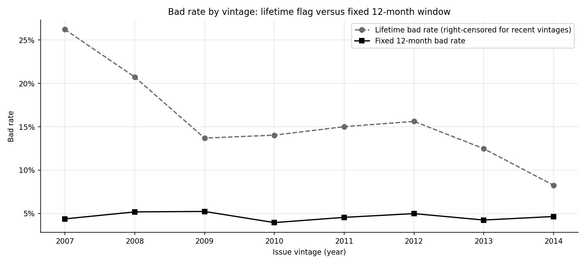{width=90%}

## Structural breaks in the inputs

Some fields were not populated the same way throughout. The share of loans with initial_list_status equal to "w" is 0% before 2012, 7.3% in 2012, 26.6% in 2013 and 52.4% in 2014; total_rev_hi_lim, tot_cur_bal and tot_coll_amt are missing before 2012 (finding F-12). A model developed on 2007 to 2012 data therefore sees a different data regime from the one it is later applied to. This is why initial_list_status is dropped from the scorecard (its information value is tiny in development) and why it dominates the characteristic stability report in section 14. The other three fields are not used as features.

# Target definitions and observation windows

## The fixed 12-month default flag

The target for the PD model is a **fixed-window** flag. A loan is flagged bad (1) if its final status is bad *and* the time from issue to the last payment date is under 12 months. Months to default are not in the file, so the last payment date is the best available proxy for the time of default: a loan that charged off after paying for 8 months has a last payment 8 months after issue, whereas a loan that paid for 30 months and then charged off does not count as a 12-month default. Loans that never paid are assigned zero months on book. Formally, with $m_i$ the months from issue to last payment:

$$Y_i = \mathbb{1}\{\text{status}_i \in \text{Bad}\} \cdot \mathbb{1}\{m_i < 12\}.$$

A loan is kept in the sample only if it has been observable for at least $12 + 2$ months, the 2 being a buffer for late reporting (`OBS_BUFFER_MONTHS`). Without the filter, a recent loan that is simply too young to have defaulted would be counted as a good, which is the censoring problem again. The functions are `targets.add_targets` (adds `target_bad12`, `obs12`, and the 24-month analogues) and `targets.target_audit`.

## Why a fixed window rather than lifetime

A lifetime flag answers "did this loan ever go bad" and its meaning depends on how long the loan was observed. A fixed window answers one question with one meaning for every loan: "did the loan go bad in its first year". That is also what a 12-month PD, used for provisioning and pricing, is supposed to measure. The cost is that the default timing proxy is imperfect (finding F-08) and the 12-month window ignores later defaults; the 24-month window is run as a sensitivity.

## How much the window removes

| Issue year | Loans with a bad status | Of which bad within 12 months | Share |
|:---------|----------------------:|----------------------------:|-----:|
| 2007 | 158 | 51 | 32.28% |
| 2008 | 496 | 198 | 39.92% |
| 2009 | 723 | 304 | 42.05% |
| 2010 | 1,759 | 561 | 31.89% |
| 2011 | 3,259 | 990 | 30.38% |
| 2012 | 8,334 | 2,662 | 31.94% |
| 2013 | 16,798 | 5,725 | 34.08% |
| 2014 | 18,909 | 10,489 | 55.47% |

Table: Loans with a bad final status and the subset that went bad within 12 months, among loans observed long enough for the 12-month window.

Roughly a third of loans with a bad final status went bad inside the 12-month window; the share is larger for 2014 because those loans have not had time to go bad later. Using the fixed window shrinks the bad rate to about 4 to 5% from the lifetime rate of 10.93% and keeps it comparable across vintages.

## In Grace Period and the 12-month window

Loans in the "In Grace Period" status were issued between 2011-01-01 and 2014-12-01 and have last payments near the status date. For the 12-month flag the second condition (last payment within 12 months of issue) is not met by any observable loan in that status: the count of In Grace Period loans that would be flagged under the 12-month rule is 0. Coding the status as bad therefore changes the mean PD by +0.0% for the 12-month target, as the sensitivity run confirms. The coding choice matters only for the lifetime flag used to reproduce the original model.

## Samples

| Sample | Loans | Target | Bad rate | Window |
|:-----------------------|------:|--------------:|-------:|---------------------------------------:|
| Development train | 74,522 | target_bad12 | 4.77% | Issued 2007-06 to 2012-12, 80% stratified |
| Development holdout | 18,631 | target_bad12 | 4.77% | Same window, 20% stratified |
| OOT 1 | 134,755 | target_bad12 | 4.25% | Issued 2013 |
| OOT 2 | 225,321 | target_bad12 | 4.66% | Issued 2014-01 to 2014-11 |
| Complete 36-month cohort | 72,566 | target_lifetime | 12.63% | 36-month loans issued to 2012-12 |
| Repro train | 373,028 | target_bad12 | 4.61% | Random 80% of all loans |
| Repro test | 93,257 | target_lifetime | 10.93% | Random 20% of all loans |

Table: Samples. Development (train and holdout) uses issues up to December 2012. OOT 1 and OOT 2 are later cohorts never used in fitting or calibration. Seed 20261001.

Development is split into a stratified random 80% training sample and a 20% holdout. The holdout provides the in-time metrics and is the data on which the gradient-boosted models are probability-calibrated; the two out-of-time samples are never touched during fitting, tuning or calibration. The "complete 36-month" cohort (36-month loans issued up to 2012, almost all fully resolved) is used with the lifetime flag for the lifetime expected-loss back-test. The repro samples reproduce the original model's random 80/20 design and are used only for the reproduction in section 9.

# Feature set and leakage controls

## Application-time features only

A PD model for decisions must use only information available when the loan is approved. The feature list (`columns.APPLICATION_FEATURES`) has 26 variables: loan amount, term, interest rate, installment, grade and sub-grade, employment length, home ownership, annual income, verification status, purpose, state, debt-to-income, delinquencies in the past two years, inquiries in the past six months, months since last delinquency and public record, open accounts, public records, revolving balance and utilization, total accounts, initial list status, and four derived variables: credit history length in months, loan-to-income, payment-to-income (installment times twelve over income) and the term in months.

## What is forbidden

All fields generated after origination are excluded by name: payments received, outstanding principal, recoveries, the last payment date, next payment date, last credit pull date, loan status itself and similar. `features.assert_no_leakage` raises an error if any feature, any column in `POST_ORIGINATION`, any vintage proxy (`mths_since_issue_d`) or any target column appears in a model's feature list, and every model-fitting entry point calls it. The vintage proxy is forbidden because loan age to a fixed reference date identifies the issue month, and issue month correlates with how long the loan was observed (section 9).

## Two champions to expose circularity

LendingClub assigns each loan a grade, a sub-grade and an interest rate using its own underwriting model. These are outputs of a risk model, so a PD model that uses them partly re-learns the lender's model. To measure how much, two scorecards are fitted: **SC_FULL** uses all application features including the four LendingClub risk outputs (grade, sub_grade, int_rate, installment), and **SC_INDEP** excludes them. The difference in performance is the value of the lender's own score. This is finding F-07 and is quantified in section 13.

# Weight of evidence, information value and the binning algorithm

## Intuition

A logistic regression needs numbers, but credit variables are messy: income is skewed, state is a label with 50 levels, and some fields are missing for a reason. Scorecard practice replaces each variable by a small number of **bins** and replaces each bin by a single number that says how much safer or riskier that bin is than average. That number is the **weight of evidence** (WoE). The variable then enters the regression as one column of WoE values, which is monotone in risk by construction, handles missing values in a bin of their own, and makes every variable's contribution to the final score visible as points.

## The math

Let $B$ be the total number of bad loans and $G$ the total number of good loans. For bin $i$ with $b_i$ bads and $g_i$ goods, let $d^B_i = b_i / B$ and $d^G_i = g_i / G$ be the shares of all bads and of all goods that fall in the bin. Then

$$\mathrm{WoE}_i = \ln\frac{d^G_i}{d^B_i}, \qquad \mathrm{IV} = \sum_i \left(d^G_i - d^B_i\right)\mathrm{WoE}_i .$$

A positive WoE means the bin holds a larger share of goods than of bads, so it is safer than average; a negative WoE means riskier. Each term of the IV is non-negative (the difference and the log have the same sign), so IV measures total separation and is zero only if every bin looks like the population. A common rule of thumb reads IV below 0.02 as not useful, 0.02 to 0.1 weak, 0.1 to 0.3 medium, 0.3 to 0.5 strong and above 0.5 suspiciously strong (Siddiqi, 2006). IV is the symmetrized Kullback-Leibler divergence between the good and bad distributions over the bins.

The sign convention matters in this project: WoE is $\ln(\%\text{good}/\%\text{bad})$, so higher WoE is safer and the fitted logit coefficient on WoE is **negative** (the logit models the chance of bad). A positive coefficient therefore signals a "wrong sign" and the variable is removed.

Empty cells make $\ln$ undefined, so shares are smoothed by adding 0.5 to every populated bin: $d^B_i = (b_i + 0.5)/(B + 0.5k)$ and similarly for goods, with $k$ the number of populated bins (`binning.woe_iv`, constant `SMOOTH`).

## Worked example: inquiries in the last six months

The champion's bins for `inq_last_6mths` (fitted on the development training sample) are:

| inq_last_6mths bin | Loans | Bad | Bad rate | WoE | IV contribution |
|:-----------------|-----:|----:|-------:|------:|--------------:|
| <= 0 | 36,404 | 1,287 | 3.54% | 0.3136 | 0.0418 |
| (0, 1] | 20,868 | 1,096 | 5.25% | -0.1003 | 0.0029 |
| (1, 2] | 10,869 | 675 | 6.21% | -0.2783 | 0.0128 |
| > 2 | 6,381 | 500 | 7.84% | -0.5285 | 0.0305 |

Table: Bins, bad rates, WoE and IV contributions for inq_last_6mths in SC_FULL (`binning_report.csv`). The Missing bin is empty and omitted.

Take the first bin (no inquiries). The sample has $B =$ 3,558 bads and $G =$ 70,964 goods in $k =$ 4 populated bins; the bin holds 1,287 bads and 35,117 goods. With smoothing, $d^B =$ 0.36166 and $d^G =$ 0.49485, so $\mathrm{WoE} = \ln(d^G/d^B) =$ 0.3136, which matches the pipeline's value 0.3136. Its IV contribution is $(d^G - d^B) \times \mathrm{WoE} =$ 0.0418. Summing the four bins gives a variable IV of 0.0880. Applicants with no recent inquiries are safer than average and each additional inquiry lowers WoE, as expected.

## The binning algorithm

`binning.fit_numeric_bins` and `binning.fit_categorical_bins` implement the fine-to-coarse classing that practitioners do by hand:

1. **Fine classing.** A numeric variable is cut at its 50 quantiles (`BIN_PREBINS`), with duplicate cut points collapsed. Missing values get their own bin that is always last.
2. **Minimum share.** Any bin holding less than 5% of loans (`BIN_MIN_SHARE`, 2% for categories) is merged into the neighbouring bin whose bad rate is closest.
3. **Monotonicity.** The sign of the Spearman correlation between bin order and bad rate sets the expected direction, and adjacent bins that violate it are merged until the bad rate is monotone. This keeps the scorecard interpretable and prevents noisy zig-zags.
4. **Cap.** If more than 8 bins (`BIN_MAX_BINS`) remain, the adjacent pair with the closest bad rates is merged until 8 remain.
5. **WoE and IV** are computed over the final bins.

Categorical variables are first sorted by their (smoothed) bad rate, so merging adjacent categories groups levels of similar risk (purpose and state). Unseen categories at scoring time go to the largest group. A bin includes values greater than its lower edge and up to and including its upper edge (`searchsorted` with `side="left"`), the same rule used in Excel.

| annual_inc bin | Loans | Bad | Bad rate | WoE | IV contribution |
|:--------------|-----:|--:|-------:|------:|--------------:|
| <= 33000 | 9,299 | 613 | 6.59% | -0.3416 | 0.0170 |
| (33000, 40000] | 7,981 | 464 | 5.81% | -0.2079 | 0.0051 |
| (40000, 52000] | 13,304 | 680 | 5.11% | -0.0713 | 0.0009 |
| (52000, 60000] | 8,832 | 432 | 4.89% | -0.0254 | 0.0001 |
| (60000, 77000] | 12,783 | 595 | 4.65% | 0.0269 | 0.0001 |
| (77000, 95000] | 9,353 | 367 | 3.92% | 0.2048 | 0.0048 |
| (95000, 122500] | 7,009 | 220 | 3.14% | 0.4353 | 0.0147 |
| > 122500 | 5,961 | 187 | 3.14% | 0.4355 | 0.0125 |

Table: Annual income bins in SC_FULL. Lower incomes carry negative WoE (riskier) and the top two bins are nearly identical.

Two observations are worth stating plainly. First, the algorithm merges by bad rate alone, so sparse categories can be grouped with unrelated ones. For example, the sub-grade bin "C2|G4" in the points table merges a mid-grade with a very thin high-risk level; a human reviewer would place G4 with the other G grades. This is a limitation of automated categorical grouping and is the reason the points table should always be reviewed. Second, the top two income bins have almost identical WoE, which suggests the cap of eight bins is slightly too fine there; the binning sensitivity in section 16 shows the Gini is insensitive to this.

## Which variables survive

Information value on the development training sample for all 26 candidate features, and the elimination outcome for SC_FULL, are below. The largest IV belongs to sub_grade (0.244).

| Variable | IV (dev train) | Band | SC_FULL | Reason dropped |
|:---------------------|-------------:|---------:|------:|-------------------------:|
| sub_grade | 0.2440 | Medium | Kept |  |
| int_rate | 0.2418 | Medium | Dropped | corr 0.95 with sub_grade |
| grade | 0.2242 | Medium | Dropped | corr 0.95 with sub_grade |
| purpose | 0.0909 | Weak | Kept |  |
| inq_last_6mths | 0.0880 | Weak | Kept |  |
| annual_inc | 0.0553 | Weak | Kept |  |
| loan_to_inc | 0.0528 | Weak | Kept |  |
| pti | 0.0506 | Weak | Dropped | corr 0.90 with loan_to_inc |
| revol_util | 0.0451 | Weak | Kept |  |
| term_m | 0.0320 | Weak | Dropped | p 0.474 > 0.05 |
| addr_state | 0.0297 | Weak | Kept |  |
| dti | 0.0239 | Weak | Kept |  |
| home_ownership | 0.0203 | Weak | Kept |  |
| credit_age_m | 0.0188 | Not useful | Dropped | IV 0.0188 < 0.02 |
| verification_status | 0.0156 | Not useful | Dropped | IV 0.0156 < 0.02 |
| emp_years | 0.0110 | Not useful | Dropped | IV 0.0110 < 0.02 |
| total_acc | 0.0103 | Not useful | Dropped | IV 0.0103 < 0.02 |
| mths_since_last_record | 0.0085 | Not useful | Dropped | IV 0.0085 < 0.02 |
| loan_amnt | 0.0058 | Not useful | Dropped | IV 0.0058 < 0.02 |
| revol_bal | 0.0055 | Not useful | Dropped | IV 0.0055 < 0.02 |
| installment | 0.0041 | Not useful | Dropped | IV 0.0041 < 0.02 |
| mths_since_last_delinq | 0.0018 | Not useful | Dropped | IV 0.0018 < 0.02 |
| delinq_2yrs | 0.0008 | Not useful | Dropped | IV 0.0008 < 0.02 |
| initial_list_status | 0.0001 | Not useful | Dropped | IV 0.0001 < 0.02 |
| open_acc | 0.0001 | Not useful | Dropped | IV 0.0001 < 0.02 |
| pub_rec | 0.0000 | Not useful | Dropped | IV 0.0000 < 0.02 |

Table: Information value of each candidate feature and its fate in SC_FULL (development training sample, bins fitted by the pipeline).

# Scorecard scaling and a worked loan

## From logit to points

Customers and credit officers read scores, not log-odds. A scorecard rescales the model's log-odds to points using three conventions: a **base score** at **base odds** (good to bad) and **points to double the odds** (PDO). Here the base score is 600 at odds of 50 to 1 and PDO is 20: every 20 extra points doubles the good:bad odds. The logit model gives the log-odds of *bad*, $z = \ln\frac{p}{1-p}$, so

$$\text{Score} = \text{Offset} - \text{Factor}\cdot z, \qquad \text{Factor} = \frac{\text{PDO}}{\ln 2}, \qquad \text{Offset} = \text{BaseScore} - \text{Factor}\cdot\ln(\text{BaseOdds}).$$

With the project settings, Factor is 28.8539 and Offset is 487.1229 (`scorecard.scaling`). Because $z = \alpha + \sum_j \beta_j\,\mathrm{WoE}_{ij}$ for loan $i$, with $\alpha$ the intercept and $k$ the number of variables, the score is a sum of one term per variable, each of which is a points value for the bin the loan falls in:

$$\text{Points}_{ij} = -\left(\beta_j\,\mathrm{WoE}_{ij} + \frac{\alpha}{k}\right)\text{Factor} + \frac{\text{Offset}}{k}.$$

The intercept and the offset are spread equally over the $k$ variables so that every bin has a self-contained points value (`Scorecard.export_points_table`, `points_by_variable`). The probability of bad is recovered from the score by inverting the formula.

| Score | Good : bad odds | Implied PD |
|:----|--------------:|---------:|
| 500.0 | 1.6 : 1 | 39.024% |
| 550.0 | 8.8 : 1 | 10.164% |
| 573.6 | 20.0 : 1 | 4.756% |
| 600.0 | 50.0 : 1 | 1.961% |
| 650.0 | 282.8 : 1 | 0.352% |
| 700.0 | 1,600.0 : 1 | 0.062% |

Table: Score to odds to PD map implied by the scaling (before any recalibration). A score of 600 corresponds to a PD of 1.96% and the development average PD of about 4.8% corresponds to a score near 573.5.

## The champion scorecard

SC_FULL retains 9 variables: `sub_grade`, `home_ownership`, `annual_inc`, `purpose`, `addr_state`, `dti`, `inq_last_6mths`, `revol_util`, `loan_to_inc`. Elimination (`scorecard.fit_scorecard`) removed 13 variables with IV below 0.02, 3 for WoE correlation above 0.7 with a stronger variable (grade and int_rate lose to sub_grade, pti to loan_to_inc) and 1 for a Wald p-value above 0.05 (term). It also removes any variable with a wrong-signed coefficient and any with a variance inflation factor above 5, though none was removed for those reasons. SC_INDEP retains: `term_m`, `home_ownership`, `annual_inc`, `purpose`, `addr_state`, `dti`, `inq_last_6mths`, `revol_util`, `loan_to_inc`.

| Variable | IV | Bins | Coefficient | Wald p | VIF | Min points | Max points | Range |
|:-------------|-----:|---:|----------:|------:|---:|---------:|---------:|----:|
| sub_grade | 0.2440 | 10 | -0.8064 | 2.4e-75 | 1.45 | 44.6 | 95.1 | 50.5 |
| home_ownership | 0.0203 | 3 | -0.3847 | 0.003 | 1.13 | 62.1 | 65.6 | 3.4 |
| annual_inc | 0.0553 | 8 | -1.0090 | 8.2e-33 | 1.26 | 53.8 | 76.4 | 22.6 |
| purpose | 0.0909 | 8 | -0.9392 | 6.7e-60 | 1.01 | 40.9 | 78.0 | 37.1 |
| addr_state | 0.0297 | 10 | -0.9916 | 2.7e-21 | 1.00 | 56.3 | 76.5 | 20.2 |
| dti | 0.0239 | 6 | -0.4986 | 1.7e-05 | 1.09 | 59.7 | 66.3 | 6.5 |
| inq_last_6mths | 0.0880 | 4 | -0.8226 | 5.6e-41 | 1.10 | 51.2 | 71.2 | 20.0 |
| revol_util | 0.0451 | 7 | -0.4023 | 6.1e-06 | 1.32 | 47.0 | 66.9 | 19.9 |
| loan_to_inc | 0.0528 | 8 | -0.3667 | 3.4e-06 | 1.21 | 58.8 | 66.4 | 7.6 |

Table: SC_FULL variables. IV is the variable's information value, coefficient is on WoE (negative as expected), points range is the spread between the best and worst bin.

The widest points range belongs to sub_grade (50.5 points) and the narrowest to home_ownership (3.4 points). Sub-grade and purpose carry most of the score, consistent with their information values.

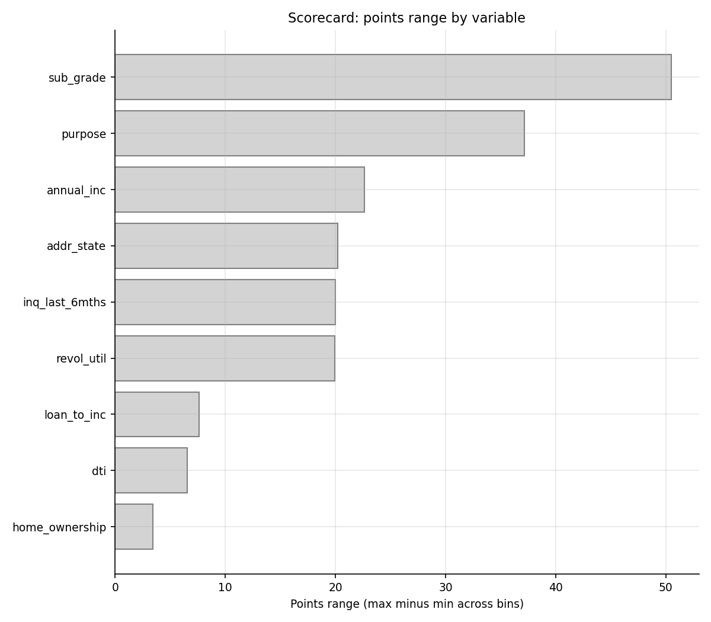{width=90%}

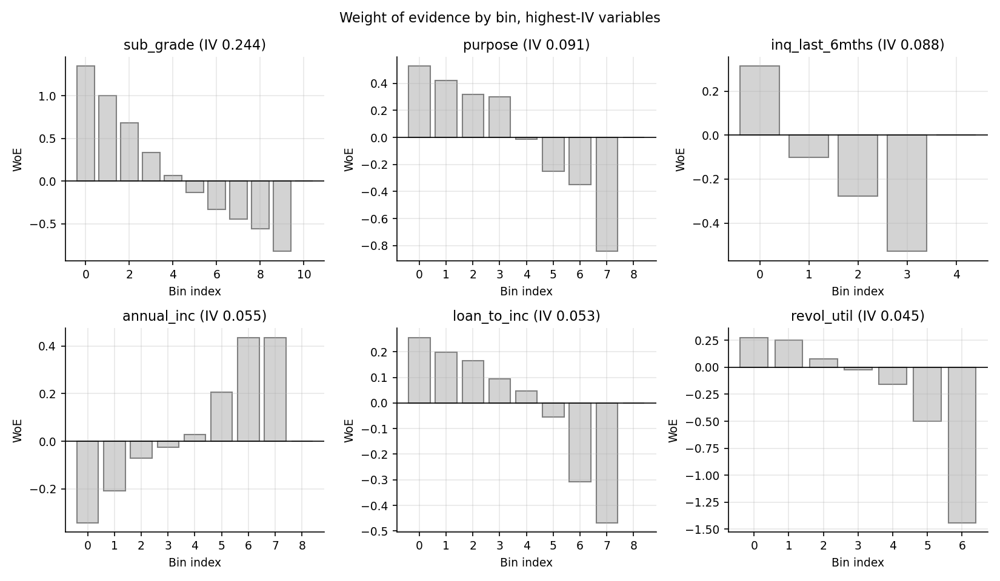{width=90%}

## A worked loan

The first loan of the 2013 Excel sample (id 10169301, sub-grade B2) is scored below. For each variable the loan's value is located in a bin, the bin's WoE is read from the points table, and the points follow from the formula.

| Variable | Value | Bin | WoE | Coefficient | Coef x WoE | Points |
|:-------------|----------:|--------------------:|------:|----------:|---------:|-----:|
| sub_grade | B2 | B1/B2/B3 | 0.3384 | -0.8064 | -0.2728 | 71.61 |
| home_ownership | RENT | OTHER/RENT | -0.1189 | -0.3847 | 0.0458 | 62.42 |
| annual_inc | 85000 | (77000, 95000] | 0.2048 | -1.0090 | -0.2067 | 69.70 |
| purpose | credit_card | credit_card | 0.4225 | -0.9392 | -0.3968 | 75.19 |
| addr_state | FL | FL/SC | -0.1678 | -0.9916 | 0.1663 | 58.94 |
| dti | 19.29 | (16.35, 20.29] | -0.0869 | -0.4986 | 0.0433 | 62.49 |
| inq_last_6mths | 1 | (0, 1] | -0.1003 | -0.8226 | 0.0825 | 61.36 |
| revol_util | 57.4 | (31, 65.8] | 0.0790 | -0.4023 | -0.0318 | 64.65 |
| loan_to_inc | 0.0823529 | (0.0666667, 0.120673] | 0.1982 | -0.3667 | -0.0727 | 65.83 |

Table: Score walk-through for loan 10169301. Points are rounded to two decimals in the table.

The nine points values sum to 592.178, equal to the score recorded in the sample (592.178). Going the other way, the sum of coefficient times WoE is -0.6429; adding the intercept -2.9980 gives a log-odds of bad of -3.6409. The probability is $1/(1+e^{-z})$ = 2.556% (the pipeline stores 2.556%), equivalent to good:bad odds of 38.1 to 1. As a check on the points formula, the offset per variable is $\text{Offset}/k =$ 54.125 with $k =$ 9 variables. This walk-through is also the first calculator in the Excel workbook (section 20), where a reviewer can change an attribute and watch the points move.

# Logistic regression and Wald p-values

## Intuition and the model

Given WoE-transformed inputs $x_i$, logistic regression models the probability of bad as $p_i = 1/(1+e^{-x_i^\top\beta})$ and estimates $\beta$ by maximum likelihood. Reviewers also ask whether each coefficient is statistically different from zero. The standard answer is the **Wald test**: divide the coefficient by its standard error and compare with a normal distribution.

## Fisher information and the Wald p-value

The log-likelihood is $\ell(\beta) = \sum_i [\,y_i \ln p_i + (1-y_i)\ln(1-p_i)\,]$. Its curvature at the maximum, the **Fisher information**, is

$$I(\hat\beta) = X^\top V X, \qquad V = \mathrm{diag}\big(\hat p_i(1-\hat p_i)\big),$$

where $X$ has a leading column of ones for the intercept. The large-sample covariance of the estimator is $I(\hat\beta)^{-1}$, so

$$\mathrm{SE}(\hat\beta_j) = \sqrt{\big[(X^\top V X)^{-1}\big]_{jj}}, \qquad z_j = \frac{\hat\beta_j}{\mathrm{SE}(\hat\beta_j)}, \qquad p_j = 2\,\Phi(-|z_j|).$$

The intercept must be a row and column of $X^\top V X$. Dropping it is not harmless. For a model with an intercept and one slope, write the matrix entries $F_{00} = \sum v_i$, $F_{01} = \sum v_i x_i$, $F_{11} = \sum v_i x_i^2$ with $v_i = \hat p_i(1-\hat p_i)$. The correct slope variance is $[F^{-1}]_{11} = F_{00}/(F_{00}F_{11} - F_{01}^2)$, which equals $1/(F_{11} - F_{01}^2/F_{00})$ and is never smaller than $1/F_{11}$, the value obtained when the intercept row and column are omitted. Omitting the intercept therefore always understates the standard error and overstates significance.

## Worked toy example

Take eight points with $x = 0, 1, \dots, 7$ and outcomes $y = 0,0,1,0,1,0,1,1$. The unpenalized maximum-likelihood fit is $\hat\beta_0 =$ -2.0793 and $\hat\beta_1 =$ 0.5941. At these estimates the information matrix has $F_{00} =$ 1.4003, $F_{01} =$ 4.9011 and $F_{11} =$ 22.5063, with determinant 7.4950. Inverting gives $\mathrm{SE}(\hat\beta_1) =$ 0.4322, so $z =$ 1.374 and the two-sided p-value is 0.1693; statsmodels returns 0.1693. If the intercept is omitted from the matrix the slope standard error becomes $1/\sqrt{F_{11}} =$ 0.2108 and the p-value falls to 0.0048, turning a non-significant slope into a "significant" one.

## The as-built defect and the corrected class

The original `LogisticRegression_with_p_values` built its Fisher matrix without an intercept column and wrapped scikit-learn's `LogisticRegression` with its default L2 penalty (`C=1`), so the coefficients were not the maximum-likelihood estimates at which the formula above is valid. Both effects invalidate the p-values (finding F-06). The corrected `stats_models.LogisticRegressionWithPValues` fits with `C=inf` (no penalty), carries the intercept in $X^\top V X$ and agrees with statsmodels to $10^{-5}$ in the unit tests; `LinearRegressionWithPValues` does the same for OLS with $n-p-1$ degrees of freedom. The scorecard itself uses statsmodels directly.

To see how much the defect matters on real data, the as-built logic was re-created on the LGD stage 1 design (a penalized fit, no intercept in the Fisher matrix) and compared with the corrected class. Over 31 terms, 11 are significant at 5% with the corrected class and 12 with the as-built logic; the verdict differs for 1 term(s), and the median ratio of as-built to corrected standard errors is 1.00. The practical impact on this design is small because the inputs are standardized (nearly orthogonal to the constant) and the penalty is mild with 14 thousand observations. The defect is still a real correctness problem, because it would matter more for unstandardized inputs such as the dummy design of the PD model, and variable selection built on it is unsupported. It is mentioned honestly as a low-impact, high-principle finding.

# Reproduction of the original model

## What was reproduced

The original PD model is a logistic regression on a dummy design of coarse classes (84 columns including a loan-age ladder). The cut points were transcribed from the original notebooks (`repro_original.ORIGINAL_COARSE_CLASSES`), reference categories dropped as in the original, the lifetime default flag used as target and a random 80/20 split on all loans applied. The original pickled model (`pd_model.sav`) is not available and the Final notebook contains no fitting cell for it (finding F-10), so the model was re-fit here with the same specification. The goal is not to match a number but to check whether the *design* behaves as claimed.

## Result on its own random test

| Specification | Dummy columns | Test AUC | Test Gini | Test KS |
|:----------------------|------------:|-------:|--------:|------:|
| With mths_since_issue_d | 84 | 0.7018 | 0.4035 | 0.2966 |
| Without it | 77 | 0.6881 | 0.3762 | 0.2782 |

Table: Reproduction on the random 20% test (93,257 loans; training 373,028 loans, lifetime bad rate 10.93%). The loan-age proxy mths_since_issue_d is the variable of concern.

The reproduced model has Gini 0.404 on its own random test, in line with a model of this kind. Removing the loan-age ladder lowers Gini by 0.0273, so the proxy contributes some ranking power on that test. That is the problem: loan age to a fixed reference date identifies the issue month, issue month determines how long a loan was observed, and a lifetime flag depends on how long a loan was observed. The feature can therefore learn the censoring pattern rather than borrower quality, and its gain on a random split does not carry to genuinely later loans.

## Out-of-time behaviour

Scored on the 12-month target, the reproduced model has Gini 0.375 on 2013 and 0.370 on 2014 loans, comparable to or higher than SC_FULL, so ranking alone does not expose the problem. What exposes it is stability. The score distribution drifts because loan age falls steadily for later issues: score PSI is 0.082 for 2013 and 0.912 for 2014 (Red), the mean predicted PD slides from 0.132 in early 2010 to 0.066 in the last quarter of 2014, and the quarterly PSI reaches 1.808. Its calibration against the 12-month target is meaningless by construction because it predicts a lifetime outcome, which is why only its random-test calibration is reported. No amount of recalibration fixes a drift that comes from a mechanical feature.

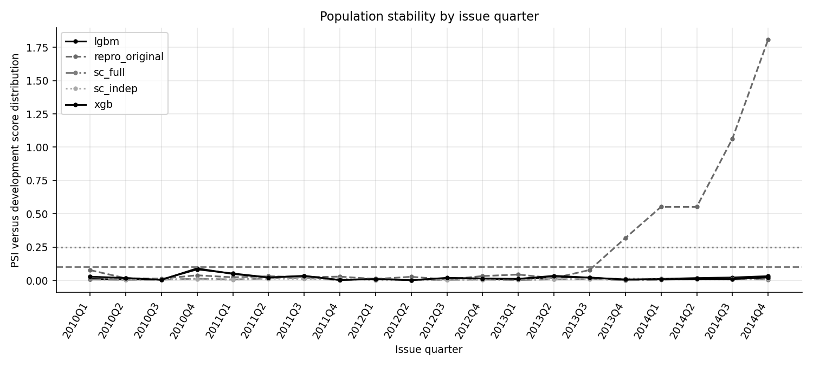{width=90%}

This is the validation conclusion on the loan-age feature: it adds measurable apparent power in a random test, it drifts mechanically out of time, and it should be removed (finding F-01). The rebuilt scorecards do not contain it.

# Validation framework and thresholds

## Structure

Every test is run through one function layer (`validation.py`, `stability.py`, `benchmark.py`) that returns a row with the test name, model, sample, value, threshold text and a traffic light. `validation.run_battery` runs the full battery for every model on every applicable sample and writes `validation_results.csv`, so the tables in this document are views of that file. The tests fall into five families: discrimination (Gini, KS, deciles), calibration (central tendency, slope and intercept, Hosmer-Lemeshow, binomial by grade), stability (PSI, CSI), benchmarking (against sub_grade and between models) and outcomes (expected loss versus realized loss).

## Thresholds

| Test | Green | Amber | Red |
|:-----|------:|------:|----:|
| Gini | at least 0.40 | at least 0.30 | below 0.30 |
| KS | at least 0.30 | at least 0.20 | below 0.20 |
| Gini decay, holdout to out-of-time | at most 10% | at most 20% | above 20% |
| Score or feature PSI | at most 0.10 | at most 0.25 | above 0.25 |
| Hosmer-Lemeshow p-value | at least 0.05 | at least 0.01 | below 0.01 |
| Grade binomial p-value (Jeffreys) | at least 0.05 | at least 0.0001 | below 0.0001 |
| Central tendency, relative deviation | at most 10% | at most 25% | above 25% |
| Calibration slope | 0.9 to 1.1 | 0.8 to 1.2 | outside |
| Decile rank-order inversions | 0 | at most 2 | more than 2 |

Table: Traffic-light thresholds (`config.THRESHOLDS`).

These thresholds are common practitioner conventions chosen for this project. The PSI bands of 0.10 and 0.25 are the usual industry rule of thumb. The Gini and KS levels are generic and not tuned to unsecured consumer lending, where a Gini of 0.35 may be reasonable for a platform whose applicants were already screened, so Amber on discrimination should be read as "below a generic target" rather than "defective". The binomial traffic light is used by analogy with the Basel backtesting traffic light, which assigns green, yellow and red zones to the number of exceptions of a value-at-risk model (Basel Committee, 1996); the zone cut-offs here are this project's own p-value limits, not Basel's.

Benchmark rule: a model is Green against sub_grade if its AUC is higher and the DeLong test is significant at 5%, Amber if higher but not significant, and Red if it does not beat the benchmark. Expected-loss back-tests are rated by the ratio of expected to realized loss: Green within 10%, Amber within 25%, Red beyond.

# Tests: formulas, worked examples and results

## Discrimination: AUC, Gini and KS

**Intuition.** A good PD model gives bad loans higher PDs than good loans. The **AUC** is the probability that a randomly chosen bad loan has a higher predicted PD than a randomly chosen good loan (ties count half). The **Gini** (accuracy ratio) rescales it so that 0 is a random model and 1 a perfect one, and the **KS** statistic is the largest gap between the cumulative share of bads and the cumulative share of goods when loans are sorted from riskiest to safest.

$$\mathrm{AUC} = \frac{1}{n_1 n_0}\sum_{i:\,y_i=1}\ \sum_{j:\,y_j=0}\left[\mathbb{1}(p_i>p_j) + \tfrac12\,\mathbb{1}(p_i=p_j)\right], \qquad \mathrm{Gini} = 2\,\mathrm{AUC}-1, \qquad \mathrm{KS} = \max_t\big|F_1(t)-F_0(t)\big|.$$

**Worked toy example.** Six loans have predicted PDs 0.95, 0.85, 0.70, 0.55, 0.40, 0.20 and the first, second and fourth defaulted. There are $n_1 \times n_0 = 3 \times 3 =$ 9 bad-good pairs and 8 of them rank the bad loan higher, so AUC = 0.889 and Gini = 0.778. Sorting riskiest first and accumulating:

| Rank (riskiest first) | Predicted PD | Bad | Cum. share of bads | Cum. share of goods | Gap |
|:--------------------|-----------:|--:|-----------------:|------------------:|----:|
| 1 | 0.95 | 1 | 0.333 | 0.000 | 0.333 |
| 2 | 0.85 | 1 | 0.667 | 0.000 | 0.667 |
| 3 | 0.70 | 0 | 0.667 | 0.333 | 0.333 |
| 4 | 0.55 | 1 | 1.000 | 0.333 | 0.667 |
| 5 | 0.40 | 0 | 1.000 | 0.667 | 0.333 |
| 6 | 0.20 | 0 | 1.000 | 1.000 | 0.000 |

Table: KS on the six-loan toy. The largest gap is the KS, 0.667.

**Implementation.** `validation.auc` computes AUC from average ranks (the Mann-Whitney identity, exact with ties), `validation.ks` evaluates the gap only after the last tied score, and `validation.cap_table` builds the cumulative accuracy profile.

**Result.**

| Model | Sample | AUC | Gini | KS | Brier | Brier skill |
|:------------------|----------:|-----:|-----:|-----:|------:|----------:|
| SC_FULL scorecard | dev_holdout | 0.6859 | 0.3719 | 0.2807 | 0.04457 | 0.0191 |
| SC_FULL scorecard | oot1 | 0.6765 | 0.3530 | 0.2544 | 0.04007 | 0.0149 |
| SC_FULL scorecard | oot2 | 0.6728 | 0.3456 | 0.2493 | 0.04366 | 0.0164 |
| SC_INDEP scorecard | dev_holdout | 0.6610 | 0.3221 | 0.2405 | 0.04481 | 0.0138 |
| SC_INDEP scorecard | oot1 | 0.6473 | 0.2945 | 0.2084 | 0.04021 | 0.0115 |
| SC_INDEP scorecard | oot2 | 0.6329 | 0.2658 | 0.1916 | 0.04397 | 0.0094 |
| XGBoost | dev_holdout | 0.6984 | 0.3967 | 0.3064 | 0.04442 | 0.0224 |
| XGBoost | oot1 | 0.6876 | 0.3752 | 0.2795 | 0.04011 | 0.0140 |
| XGBoost | oot2 | 0.6869 | 0.3738 | 0.2738 | 0.04356 | 0.0186 |
| LightGBM | dev_holdout | 0.6922 | 0.3844 | 0.2821 | 0.04449 | 0.0208 |
| LightGBM | oot1 | 0.6832 | 0.3664 | 0.2655 | 0.04007 | 0.0149 |
| LightGBM | oot2 | 0.6833 | 0.3665 | 0.2693 | 0.04357 | 0.0183 |
| Reproduced original | dev_holdout | 0.6767 | 0.3534 | 0.2720 | 0.05715 | -0.2577 |
| Reproduced original | oot1 | 0.6877 | 0.3755 | 0.2756 | 0.04892 | -0.2025 |
| Reproduced original | oot2 | 0.6851 | 0.3702 | 0.2700 | 0.04536 | -0.0219 |

Table: Discrimination by model and sample (all models, development holdout and out of time).

For SC_FULL the Gini is 0.372, 0.353 and 0.346 and KS is 0.281, 0.254 and 0.249, all Amber. SC_INDEP is Red out of time (Gini 0.295 and 0.266). The 95% bootstrap interval for the SC_FULL Gini on 2013 loans is 0.331 to 0.375 (loan-level percentile bootstrap, section 12). On the 2013 sample the largest KS gap occurs at decile 4.

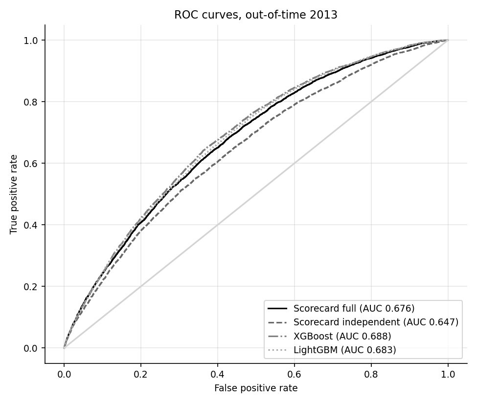{width=70%}

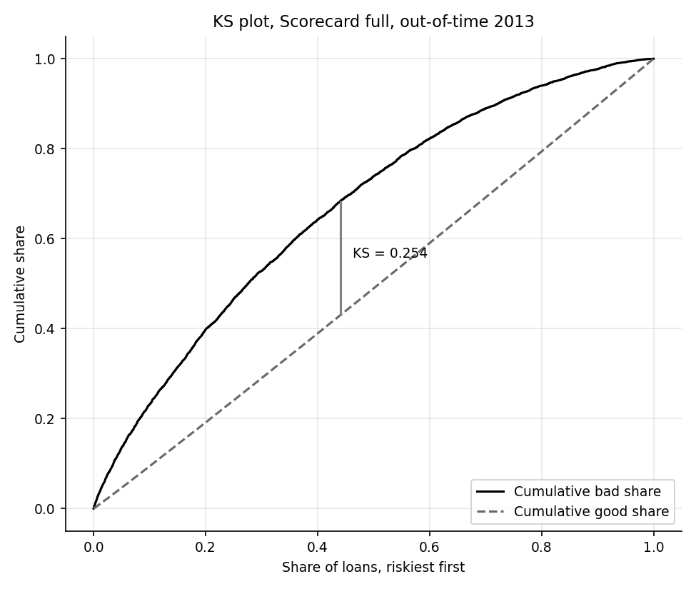{width=70%}

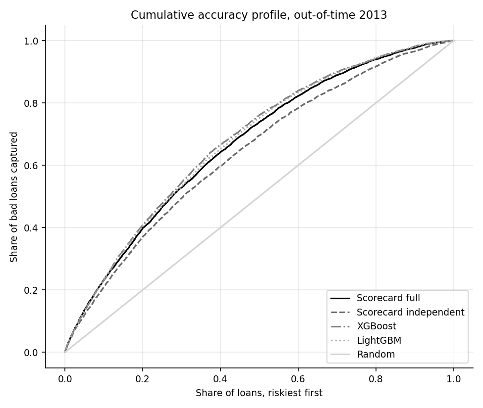{width=70%}

## Rank ordering: deciles

Loans are ranked by predicted PD, riskiest first, and cut into ten equal groups with decile = $\lfloor 10(\text{rank}-1)/n\rfloor + 1$. A sound model has bad rates that fall monotonically down the table; any adjacent pair where the bad rate rises is an **inversion**. Lift is the decile bad rate divided by the portfolio bad rate.

| Decile (1 = riskiest) | Loans | Bad | Bad rate | Mean PD | Cum. bads | Cum. goods | Gap | Lift |
|:--------------------|-----:|----:|-------:|------:|--------:|---------:|-----:|---:|
| 1 | 13,476 | 1,325 | 9.83% | 12.24% | 23.14% | 9.42% | 0.1373 | 2.31 |
| 2 | 13,475 | 954 | 7.08% | 8.19% | 39.81% | 19.12% | 0.2069 | 1.67 |
| 3 | 13,476 | 744 | 5.52% | 6.52% | 52.80% | 28.99% | 0.2381 | 1.30 |
| 4 | 13,475 | 653 | 4.85% | 5.39% | 64.21% | 38.93% | 0.2528 | 1.14 |
| 5 | 13,476 | 555 | 4.12% | 4.49% | 73.90% | 48.94% | 0.2496 | 0.97 |
| 6 | 13,475 | 478 | 3.55% | 3.74% | 82.25% | 59.01% | 0.2324 | 0.83 |
| 7 | 13,476 | 383 | 2.84% | 3.08% | 88.94% | 69.16% | 0.1978 | 0.67 |
| 8 | 13,475 | 289 | 2.14% | 2.47% | 93.99% | 79.38% | 0.1461 | 0.50 |
| 9 | 13,476 | 212 | 1.57% | 1.85% | 97.69% | 89.66% | 0.0804 | 0.37 |
| 10 | 13,475 | 132 | 0.98% | 1.09% | 100.00% | 100.00% | 0.0000 | 0.23 |

Table: SC_FULL deciles on 2013 loans (`deciles_sc_full_oot1.csv`).

The riskiest decile has an observed bad rate of 9.83% (lift 2.31) and holds 23.1% of all bads; the safest decile has a bad rate of 0.98%. There are 0 inversions on 2013 loans (Green). The model is also run at sub-grade level (33 to 35 groups with at least 100 loans): SC_FULL has 11 adjacent inversions on 2013 loans when sub-grades are ordered by their mean predicted PD, which is expected for small groups with noisy observed rates.

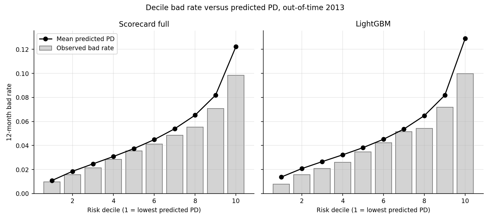{width=80%}

## Calibration: central tendency, slope and intercept

**Central tendency** compares the average predicted PD with the observed bad rate, as a relative deviation $|\bar p - \bar y|/\bar y$. **Calibration slope and intercept** come from a logistic recalibration $\mathrm{logit}(P(y=1)) = a + b\,\mathrm{logit}(p)$ on the out-of-time data. A perfectly calibrated model has $a = 0$ and $b = 1$. A slope below 1 means predictions are too spread out (high PDs too high, low PDs too low); an intercept below zero means PDs are too high on average.

The **Brier score** $\frac1n\sum(p_i-y_i)^2$ rewards both discrimination and calibration, and the Brier skill score $1 - \mathrm{Brier}/(\bar y(1-\bar y))$ compares it with always predicting the portfolio rate.

| Model | Sample | Mean PD | Observed | Slope | Intercept | HL p | HL statistic |
|:------------|-----:|------:|-------:|----:|--------:|------:|-----------:|
| sc_full | oot1 | 4.91% | 4.25% | 0.927 | -0.356 | 2.8e-26 | 145.7 |
| sc_full | oot2 | 4.95% | 4.66% | 0.905 | -0.329 | 4.3e-16 | 95.5 |
| sc_indep | oot1 | 4.49% | 4.25% | 0.904 | -0.341 | 4.2e-07 | 49.0 |
| sc_indep | oot2 | 4.49% | 4.66% | 0.809 | -0.523 | 1.1e-23 | 133.1 |
| xgb | oot1 | 5.18% | 4.25% | 0.942 | -0.369 | 4.8e-57 | 293.0 |
| xgb | oot2 | 4.90% | 4.66% | 0.928 | -0.253 | 2.5e-15 | 91.7 |
| lgbm | oot1 | 5.06% | 4.25% | 0.973 | -0.261 | 2.3e-45 | 237.5 |
| lgbm | oot2 | 4.92% | 4.66% | 0.966 | -0.154 | 1.7e-15 | 92.6 |
| sc_full_recal | oot2 | 4.29% | 4.66% | 0.905 | -0.189 | 4.2e-24 | 135.1 |

Table: Calibration summary. Slope and intercept from the logistic recalibration; HL is the Hosmer-Lemeshow test (next section).

SC_FULL over-predicts on 2013 loans (mean PD 4.91% against an observed 4.25%, relative deviation 15.5%, Amber) and is within 6.4% on 2014 loans (Green). The slope is below one on both samples (0.927 and 0.905) and the intercept is negative (-0.356, -0.329): the model is somewhat over-confident and too high on average, with the problem concentrated in the top deciles. The Brier skill is low (0.0149 on 2013 loans) because defaults are rare events (about 4 to 5%) and the achievable improvement over a constant is small.

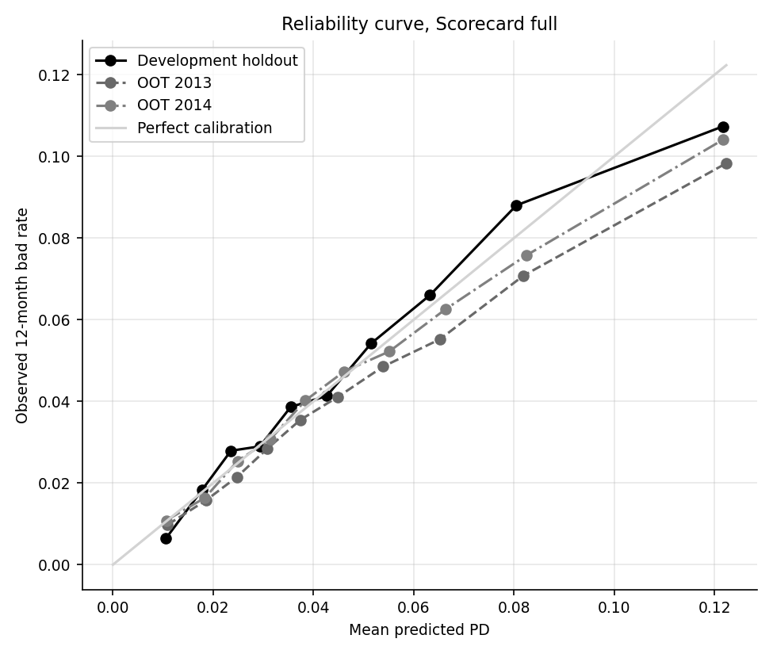{width=70%}

## Calibration: Hosmer-Lemeshow

**Intuition.** Sort loans by predicted PD, cut into $g$ equal-sized groups, and compare the expected number of bads in each group with the number observed. **Math.** For group $k$ with $n_k$ loans, mean predicted PD $\bar p_k$ and $O_k$ observed bads,

$$H = \sum_{k=1}^{g} \frac{(O_k - n_k\bar p_k)^2}{n_k\,\bar p_k(1-\bar p_k)} \;\sim\; \chi^2_{g-2}\ \text{in sample},\qquad \chi^2_{g}\ \text{out of sample}$$

(Hosmer and Lemeshow, 1980). The pipeline uses $g=10$ with $g-2$ degrees of freedom on the development training sample and $g$ on holdout and out-of-time data (`validation.hosmer_lemeshow`).

**Worked toy example.** Three groups of 1,000 loans with mean PDs 2%, 5%, 10% and observed bads 15, 60, 125:

| Group | Loans | Mean PD | Expected bads | Actual bads | Contribution |
|:----|----:|------:|------------:|----------:|-----------:|
| 1 | 1,000 | 2% | 20 | 15 | 1.276 |
| 2 | 1,000 | 5% | 50 | 60 | 2.105 |
| 3 | 1,000 | 10% | 100 | 125 | 6.944 |

Table: Hosmer-Lemeshow toy. The statistic is 10.325 on 3 degrees of freedom, p-value 0.0160.

**Result on real data.** The ten groups for SC_FULL on 2013 loans:

| Bin (low to high PD) | Loans | Mean PD | Observed | Expected bads | Actual bads | (O-E)^2 / (n p (1-p)) |
|:-------------------|-----:|------:|-------:|------------:|----------:|--------------------:|
| 1 | 13,476 | 1.09% | 0.98% | 146.9 | 132 | 1.53 |
| 2 | 13,475 | 1.85% | 1.57% | 249.6 | 212 | 5.76 |
| 3 | 13,476 | 2.47% | 2.14% | 332.7 | 289 | 5.88 |
| 4 | 13,475 | 3.08% | 2.84% | 415.0 | 383 | 2.55 |
| 5 | 13,476 | 3.74% | 3.55% | 503.6 | 478 | 1.35 |
| 6 | 13,475 | 4.49% | 4.11% | 604.7 | 554 | 4.46 |
| 7 | 13,476 | 5.39% | 4.85% | 726.3 | 654 | 7.61 |
| 8 | 13,475 | 6.52% | 5.52% | 878.7 | 744 | 22.10 |
| 9 | 13,476 | 8.19% | 7.08% | 1,103.4 | 954 | 22.04 |
| 10 | 13,475 | 12.24% | 9.83% | 1,648.7 | 1,325 | 72.43 |

Table: Hosmer-Lemeshow groups for SC_FULL on 2013 loans. The contributions sum to 145.7 on 10 degrees of freedom, p-value 2.8e-26.

The statistic is 145.7 on 2013 loans (Red) and 95.5 on 2014 loans (Red), against 10.8 on the holdout (p = 0.376, Green). The tenth group alone (13,475 loans, predicted 12.24%, observed 9.83%, expected 1,648.7 bads against 1,325 actual) contributes 72.43, or 50% of the total.

**Honest reading, including the power caveat.** With over 130,000 loans in a sample the test has so much power that it rejects deviations of a fraction of a percentage point. A 1-point gap between predicted and observed in a group of 13,000 loans is statistically overwhelming but economically small. The statistic is therefore not dismissed here, and it is not obeyed blindly either. The Red result is real in the sense that the model is mis-calibrated out of time: the gap is concentrated in the riskiest decile, predicted 12.24% against observed 9.83%, an over-prediction of about 24% in the group that matters most for pricing and cut-offs. What the test cannot say is whether that gap is large enough to matter commercially. The calibration slope (Green) and the decile table are the better guide to magnitude, and the fix is a recalibration (below), not a rebuild. The pipeline flags every Hosmer-Lemeshow result on samples above 100,000 loans with this caveat.

A recalibrated challenger shifts only the intercept by -0.1540 so that the mean PD equals the 2013 bad rate. It is evaluated on 2014 loans only (using 2013 outcomes to set the shift would make 2013 results in-sample). It does not improve the 2014 level: mean PD becomes 4.29% against 4.66% observed (relative deviation 7.9% against 6.4% unadjusted) because the default rate rose in 2014. It also remains Red on Hosmer-Lemeshow (p = 4.2e-24) and on the grade binomial test, because the gaps are by grade and by decile rather than in the overall level, which a single shift cannot fix.

## Calibration: binomial test by grade

**Intuition.** For one grade, if the predicted PD is right, the number of defaults should look like a binomial draw. **Math.** For a group with $n$ loans, mean PD $\bar p$ and $D$ observed bads, test that PD is *understated* (the dangerous direction) with

$$z = \frac{D - n\bar p}{\sqrt{n\,\bar p\,(1-\bar p)}}, \qquad p_{\text{binom}} = P\big(X \ge D\big),\ X\sim\mathrm{Bin}(n,\bar p), \qquad p_{\text{Jeffreys}} = P\big(\pi < \bar p\big),\ \pi\sim\mathrm{Beta}\big(D+\tfrac12,\ n-D+\tfrac12\big).$$

The Jeffreys form is the posterior probability, under a non-informative prior, that the true PD is below the prediction. It behaves better than the normal approximation for small counts (`validation.binomial_test_by_group`).

**Worked example.** Grade E in 2014 for SC_FULL: $n =$ 19,366 loans, mean PD 8.126%, so the expected number of bads is 1,573.7 and the standard deviation is 38.02. The observed count is 1,882 (rate 9.72%), so $z =$ 8.11 and the upper-tail p-value is essentially zero.

| Grade | Loans | Bad | Observed | Mean PD | z | Jeffreys p |
|:----|-----:|----:|-------:|------:|----:|---------:|
| A | 17,675 | 184 | 1.04% | 1.56% | -5.52 | 1.000 |
| B | 44,098 | 1,120 | 2.54% | 3.25% | -8.39 | 1.000 |
| C | 38,113 | 1,673 | 4.39% | 5.42% | -8.91 | 1.000 |
| D | 20,558 | 1,401 | 6.81% | 7.33% | -2.82 | 0.998 |
| E | 9,057 | 773 | 8.53% | 8.34% | 0.68 | 0.247 |
| F | 4,390 | 477 | 10.87% | 10.92% | -0.11 | 0.540 |
| G | 864 | 97 | 11.23% | 10.98% | 0.23 | 0.404 |

Table: SC_FULL by grade on 2013 loans. Negative z means PD is over-predicted.

| Grade | Loans | Bad | Observed | Mean PD | z | Jeffreys p |
|:----|-----:|----:|-------:|------:|-----:|---------:|
| A | 34,105 | 405 | 1.19% | 1.61% | -6.16 | 1.000 |
| B | 59,121 | 1,488 | 2.52% | 3.29% | -10.51 | 1.000 |
| C | 63,723 | 2,898 | 4.55% | 5.42% | -9.69 | 1.000 |
| D | 41,403 | 2,787 | 6.73% | 6.81% | -0.67 | 0.749 |
| E | 19,366 | 1,882 | 9.72% | 8.13% | 8.11 | 1.5e-15 |
| F | 5,974 | 764 | 12.79% | 10.88% | 4.74 | 1.8e-06 |
| G | 1,629 | 265 | 16.27% | 10.47% | 7.64 | 4.6e-13 |

Table: SC_FULL by grade on 2014 loans. Grades E, F and G are significantly under-predicted.

In 2013 no grade is flagged (smallest Jeffreys p 0.247, Green) because the model over-predicts A to D and is close for E to G. In 2014 the picture reverses: the observed rates for grades E, F and G (9.72% for E) exceed the predictions, giving a smallest p of 1.5e-15 (Red). The independent scorecard is worse: it under-predicts grades D to G in both years, which is the circularity again, because it cannot see the lender's grade. Defaults within a grade are correlated through common conditions, so the binomial test (which assumes independence) overstates how surprising the gaps are. The Red result is nonetheless consistent with the other evidence that the 2014 cohort deteriorated in the riskier grades.

# Challenger models, DeLong test and bootstrap

## Challengers

Two gradient-boosted tree models challenge the scorecard on the same 26 features. XGBoost (Chen and Guestrin, 2016) and LightGBM both grow an ensemble of shallow decision trees, each new tree fitted to the errors of the ensemble so far. Monotone constraints force the predicted PD to move in the economically expected direction for interest rate, DTI, inquiries, revolving utilization, loan-to-income, payment-to-income (increasing) and annual income and credit age (decreasing). Hyper-parameters (learning rate, depth, leaves, minimum child weight, subsampling, regularization, tree count) are chosen by random search with **expanding-window time folds**: models train on issue years before each validation year (2010, 2011, 2012) and are scored on that year's log-loss with early stopping. This avoids tuning on information from the future. The tuned models use 71 (XGBoost) and 65 (LightGBM) trees. Probabilities are calibrated on the development holdout (never on out-of-time data) by Platt scaling or isotonic regression, chosen by cross-fitted Brier score; the methods chosen were platt for XGBoost and platt for LightGBM.

## DeLong test for correlated AUCs

**Intuition.** Two models scored on the same loans have correlated AUCs, so comparing them with an unpaired test throws away information. DeLong, DeLong and Clarke-Pearson (1988) show that the AUC is a U-statistic and give a variance for the difference that accounts for the correlation.

**Math.** For $m$ bads with scores $X_i$ and $n$ goods with scores $Y_j$, define the structural components $V_{10}(X_i) = \frac1n\sum_j \psi(X_i,Y_j)$ and $V_{01}(Y_j) = \frac1m\sum_i \psi(X_i,Y_j)$, where $\psi = 1$ if $X>Y$, $\tfrac12$ if equal and $0$ otherwise. The AUC is the mean of the $V_{10}$ (or of the $V_{01}$). With $S_{10}$ and $S_{01}$ the covariance matrices of the two models' components, the covariance of the two AUCs is $S = S_{10}/m + S_{01}/n$ and, for the difference,

$$z = \frac{\widehat{\mathrm{AUC}}_1 - \widehat{\mathrm{AUC}}_2}{\sqrt{S_{11} + S_{22} - 2S_{12}}}.$$

Two sets of six scores for the toy outcomes give AUCs of 0.8889 and 1.0000, a difference of -0.1111, which is far too small a sample to be significant; the same code applied to 100,000 loans is below. The implementation is `validation.delong_test`, computed from average ranks.

## Bootstrap confidence intervals

For Gini and for AUC differences the pipeline resamples *loans* with replacement 500 times and takes the 2.5th and 97.5th percentiles (`validation.bootstrap_ci`, `bootstrap_diff_ci`). The difference is paired: the same resampled loans are scored by both models. To keep run time bounded the bootstrap uses a random subsample of up to 50,000 loans when a sample is larger, which makes the interval somewhat wider than a full-sample one. Loans, not time periods, are resampled, so the interval captures sampling noise only and not variation across economic conditions.

## Results

| Comparison | Sample | Model A | Model B | AUC A | AUC B | AUC A minus B | DeLong p | Boot CI low | Boot CI high | Light |
|:-------------------------|-----:|-----------------:|-------------:|-----:|-----:|------------:|-------:|----------:|-----------:|----:|
| vs_sub_grade | oot1 | sc_indep | sub_grade_rank | 0.6473 | 0.6736 | -0.0263 | 1.0e-13 | -0.0403 | -0.0185 | Red |
| vs_sub_grade | oot1 | sc_full | sub_grade_rank | 0.6765 | 0.6736 | +0.0029 | 0.257 | -0.0063 | 0.0102 | Amber |
| incremental_over_sub_grade | oot1 | sc_indep+sub_grade | sub_grade_rank | 0.6718 | 0.6736 | -0.0017 | 0.497 | -0.0115 | 0.0036 | Info |
| challenger_vs_champion | oot1 | sc_indep | sc_full | 0.6473 | 0.6765 | -0.0292 | 1.5e-75 | -0.0360 | -0.0262 | Info |
| challenger_vs_champion | oot1 | xgb | sc_full | 0.6876 | 0.6765 | +0.0111 | 2.6e-13 | 0.0063 | 0.0155 | Info |
| challenger_vs_champion | oot1 | lgbm | sc_full | 0.6832 | 0.6765 | +0.0067 | 6.5e-07 | 0.0038 | 0.0119 | Info |
| challenger_vs_champion | oot1 | repro_original | sc_full | 0.6877 | 0.6765 | +0.0112 | 1.1e-08 | 0.0088 | 0.0217 | Info |
| vs_sub_grade | oot2 | sc_indep | sub_grade_rank | 0.6329 | 0.6830 | -0.0501 | 1.9e-75 | -0.0590 | -0.0371 | Red |
| vs_sub_grade | oot2 | sc_full | sub_grade_rank | 0.6728 | 0.6830 | -0.0102 | 4.7e-07 | -0.0168 | -0.0013 | Red |
| incremental_over_sub_grade | oot2 | sc_indep+sub_grade | sub_grade_rank | 0.6669 | 0.6830 | -0.0161 | 1.0e-16 | -0.0226 | -0.0071 | Info |
| challenger_vs_champion | oot2 | sc_indep | sc_full | 0.6329 | 0.6728 | -0.0399 | 6.4e-225 | -0.0438 | -0.0337 | Info |
| challenger_vs_champion | oot2 | xgb | sc_full | 0.6869 | 0.6728 | +0.0141 | 3.5e-33 | 0.0087 | 0.0180 | Info |
| challenger_vs_champion | oot2 | lgbm | sc_full | 0.6833 | 0.6728 | +0.0105 | 1.1e-23 | 0.0074 | 0.0159 | Info |
| challenger_vs_champion | oot2 | sc_full_recal | sc_full | 0.6728 | 0.6728 | +0.0000 | n/a | 0.0000 | 0.0000 | Info |
| challenger_vs_champion | oot2 | repro_original | sc_full | 0.6851 | 0.6728 | +0.0123 | 1.5e-14 | 0.0053 | 0.0183 | Info |

Table: Model comparisons on the out-of-time samples. "vs_sub_grade" compares a scorecard with sub_grade used as a score; "challenger_vs_champion" compares each model with SC_FULL. Light shows the benchmark rule for the first and is informational for the others.

XGBoost improves on SC_FULL by +0.0111 AUC on 2013 and +0.0141 on 2014 and LightGBM by +0.0067 and +0.0105. With this many loans the DeLong p-values are far below 0.001, so the improvement is real, and the bootstrap interval for XGBoost on 2013 (0.0063 to 0.0155) excludes zero. But the gain is about one AUC point, the trees remain Amber on Gini (0.375 and 0.366 on 2013) and they remain Red on Hosmer-Lemeshow. The trees also show strong overfitting in development (training Gini 0.521 for LightGBM against 0.366 out of time) and a training calibration slope far from one, which is why calibration is always done on the holdout. The pragmatic conclusion is that nonlinear structure adds little over the scorecard on these features, so the scorecard's transparency is not bought at a large accuracy cost.

# Benchmark against the LendingClub grade and the circularity

## The benchmark

Any new model should beat something simple. The obvious simple model on this data is the lender's own sub-grade (35 levels, A1 to G5) treated as an ordinal risk score, with the interest rate and the 7-level grade as alternatives. Each is evaluated alone, with no fitting.

| Score used alone | AUC dev holdout | AUC OOT 2013 | AUC OOT 2014 |
|:---------------|--------------:|-----------:|-----------:|
| grade_rank | 0.6306 | 0.6657 | 0.6763 |
| int_rate | 0.6366 | 0.6735 | 0.6808 |
| sub_grade_rank | 0.6368 | 0.6736 | 0.6830 |

Table: AUC of the lender's own ratings used as scores.

On 2013 loans sub_grade alone has AUC 0.6736 and interest rate alone 0.6735; on 2014 loans the figures are 0.6830 and 0.6808. A one-variable score that costs nothing is the benchmark every candidate has to beat.

## Does the scorecard add value?

The comparison table in section 12 gives the answer. SC_FULL differs from sub_grade by +0.0029 AUC on 2013 loans (DeLong p = 0.257, not significant, Amber) and by -0.0102 on 2014 loans (p = 4.7e-07, significant and negative, Red). In other words, the champion does not add significant discrimination to the lender's own score, and in 2014 it is slightly worse. This is the headline negative result of the validation.

## The circularity

The independent scorecard SC_INDEP, built only from borrower and loan characteristics other than LendingClub's outputs, is behind the benchmark by -0.0263 and -0.0501 AUC (both Red), and adding it to sub_grade in a combined logit does not help either: the combined model is below sub_grade alone on 2013 (-0.0017 AUC, p = 0.497) and on 2014 (-0.0161, p = 1.0e-16). The cost of excluding the lender's own score is a Gini drop from 0.353 to 0.295 on 2013 and from 0.346 to 0.266 on 2014, and the independent model also decays faster over time.

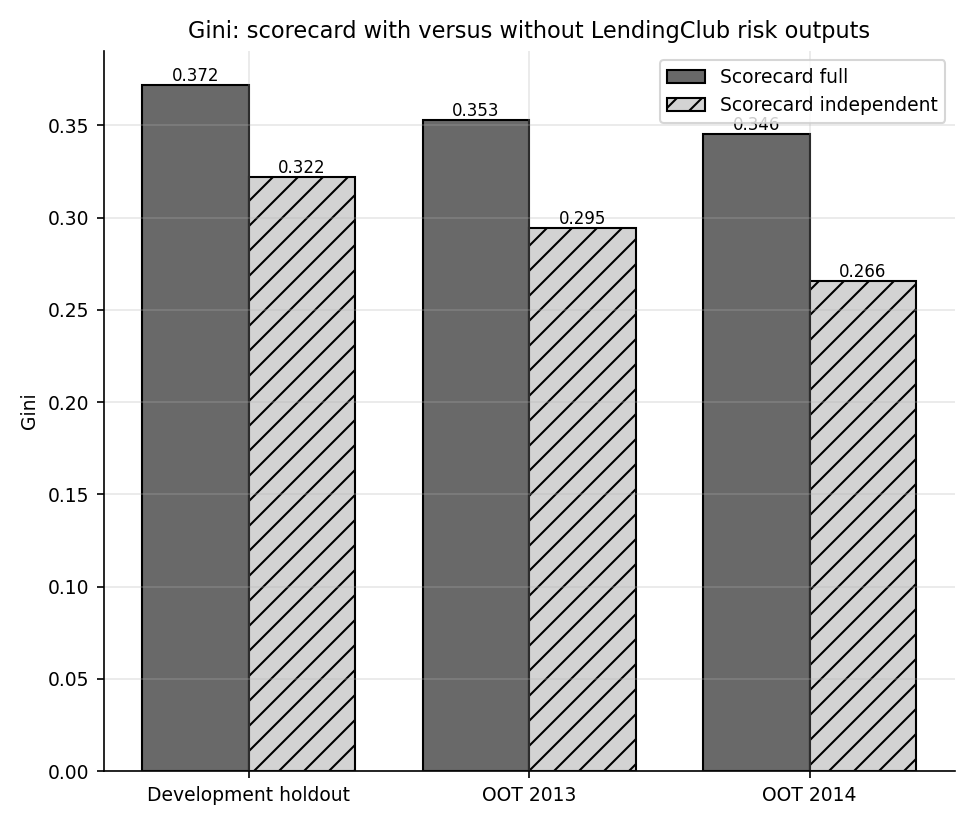{width=70%}

How to interpret this. LendingClub's grade summarises information the lender had at origination, much of it not in the public file (credit bureau attributes such as a FICO band). A model without it is missing real signal, so the lower SC_INDEP performance is not "bad modelling" alone. At the same time, a model that leans on the grade inherits the lender's own score, its drift and any errors in it, and cannot be called independent evidence of credit quality. The recommended handling is to report both models, document the dependency, and treat the independent model as the measure of what the borrower characteristics add on their own.

# Stability by vintage: PSI and CSI

## Intuition and formula

A model is only valid for the population it was built on. The **population stability index** (PSI) measures how much a distribution has moved. Bin the development scores into deciles and let $e_i$ be the share of development loans in bin $i$ and $a_i$ the share of a later sample in the same bins:

$$\mathrm{PSI} = \sum_i (a_i - e_i)\ln\frac{a_i}{e_i}.$$

Every term is non-negative, the index is zero when the distributions match, and it equals the sum of the two Kullback-Leibler divergences between them. Shares are floored at $10^{-4}$ before the logarithm so an empty bin does not produce infinity. Rules of thumb: below 0.10 stable, 0.10 to 0.25 some shift, above 0.25 material shift. Applied to a model input it is called the **characteristic stability index** (CSI); numeric inputs use development deciles plus a separate missing bin and categorical inputs use their categories (`stability.psi`, `csi`, `psi_by_quarter`).

## Worked example: initial_list_status

The field takes two values. In the development training sample and in 2014 loans the shares are:

| initial_list_status | Development share | OOT 2014 share | Difference | ln(actual / expected) | Contribution |
|:------------------|----------------:|-------------:|---------:|--------------------:|-----------:|
| f | 95.81% | 47.16% | -48.65 pp | -0.7088 | 0.3448 |
| w | 4.19% | 52.84% | +48.65 pp | 2.5341 | 1.2327 |

Table: PSI by hand for initial_list_status, development training sample versus 2014 loans. The total is 1.5775, matching the CSI in `psi_csi.csv`.

Each row contributes (actual minus expected) times the log ratio; the "w" row dominates because its share moved from a few percent to about half of the loans. That is the structural break from section 3, not borrower behaviour.

## Results

| Model | Dev holdout | OOT 2013 | OOT 2014 |
|:-------------|----------:|-------:|-------:|
| lgbm | 0.0006 | 0.0100 | 0.0152 |
| repro_original | 0.0009 | 0.0822 | 0.9117 |
| sc_full | 0.0007 | 0.0026 | 0.0067 |
| sc_indep | 0.0007 | 0.0098 | 0.0095 |
| xgb | 0.0007 | 0.0149 | 0.0078 |

Table: Score PSI against the development training sample.

Score PSI is tiny for the scorecard and the trees (SC_FULL 0.0026 in 2013 and 0.0067 in 2014), and the largest quarterly PSI over the out-of-time quarters is 0.0175 for SC_FULL across all quarters. The score distribution is stable because the models rank on a handful of characteristics whose joint distribution did not move much. The reproduced original model is the exception (section 9).

| Feature | CSI OOT 2013 | CSI OOT 2014 |
|:---------------------|-----------:|-----------:|
| initial_list_status | 0.4752 | 1.5775 |
| mths_since_last_record | 0.1368 | 0.3647 |
| purpose | 0.1755 | 0.2485 |
| pub_rec | 0.0964 | 0.2327 |
| addr_state | 0.1392 | 0.1739 |
| dti | 0.0878 | 0.1458 |
| verification_status | 0.0721 | 0.1434 |
| credit_age_m | 0.0729 | 0.1350 |

Table: Largest characteristic stability indices, ranked by 2014. The development reference is the training sample of the champion.

initial_list_status is Red in both years (0.475 and 1.578); mths_since_last_record rises from 0.137 to 0.365 (Red in 2014); purpose and state also drift into the Amber range. The maximum CSI is rated Red on both samples (0.475 and 1.578) with 1 and 2 features in the Red zone. This does not invalidate the score (it is stable) but confirms that the development period mixes data regimes, and it argues for monitoring the inputs as well as the output.

## Performance by vintage

| Issue year | Loans | Gini SC_FULL | Gini SC_INDEP | Gini LightGBM |
|:---------|------:|-----------:|------------:|------------:|
| 2007 | 251 | 0.607 | 0.536 | 0.767 |
| 2008 | 1,562 | 0.394 | 0.347 | 0.491 |
| 2009 | 4,716 | 0.345 | 0.304 | 0.504 |
| 2010 | 11,536 | 0.427 | 0.368 | 0.552 |
| 2011 | 21,721 | 0.432 | 0.399 | 0.533 |
| 2012 | 53,367 | 0.352 | 0.314 | 0.463 |
| 2013 | 134,755 | 0.353 | 0.295 | 0.366 |
| 2014 | 225,321 | 0.346 | 0.266 | 0.367 |

Table: Gini by issue year on the development and out-of-time samples (champion, independent scorecard and LightGBM). Early years are small samples.

Discrimination is similar across 2012 to 2014 for the scorecard. The high values for 2007 to 2011 are partly in-sample (these loans are in the development sample) and partly small-sample noise (251 loans in 2007), so they are not evidence of better performance in those years.

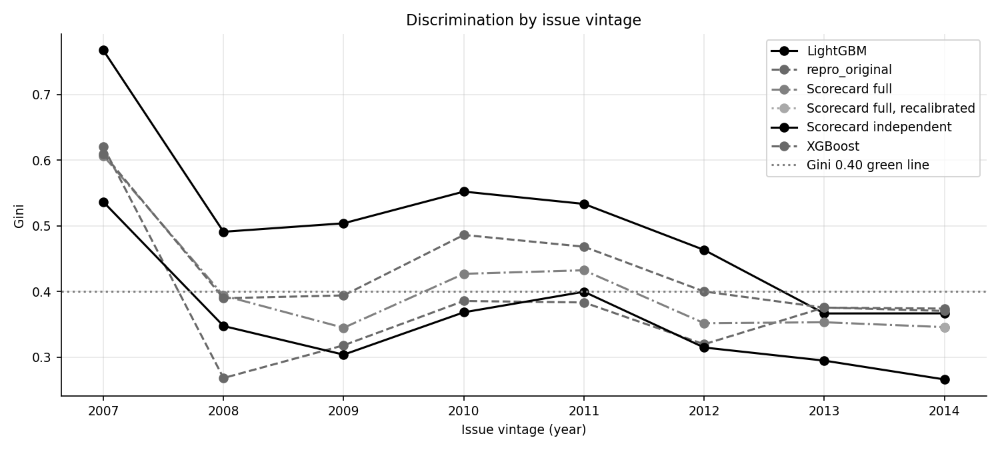{width=80%}

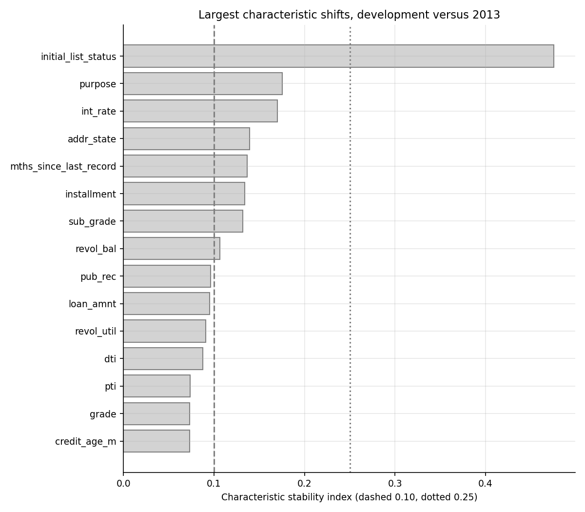{width=80%}

# LGD, EAD and expected-loss back-tests

## Population and the two-stage LGD design

LGD and EAD are modeled on loans that actually defaulted. The charged-off population is recomputed from the raw file (43,236 loans, including the charged-off status under the old credit policy) and reconciled to the original project's `loan_data_defaults.csv`: 43,236 loans match and the recovery-rate and credit-conversion-factor columns agree to within 1.1e-16. The mean recovery rate (recoveries divided by funded amount) is 0.0608 and the mean credit conversion factor is 0.7360.

LGD follows the original two-stage design. **Stage 1** is a logistic regression for whether any recovery occurs. **Stage 2** is a linear regression for the recovery rate among loans that do recover. The expected LGD is

$$\mathrm{LGD} = 1 - P(\text{recovery})\times E[\text{recovery rate}\mid\text{recovery}],$$

clipped to $[0,1]$, so the stage 1 probability is used as a probability and not as a 0/1 label (the original applied a hard cut, finding F-05; the hard-class version is kept as a comparison). **EAD** is the credit conversion factor $\mathrm{CCF} = (\text{funded} - \text{principal repaid})/\text{funded}$ predicted by a linear regression and multiplied by the funded amount. All three are fitted on defaults of loans issued to 2012 (14,419 loans for stage 1; 10,687 with a recovery for stage 2), evaluated on 2013 loans (14,836 defaults) and reported but not fitted on 2014 loans (13,981). The design uses winsorized, standardized application variables, with grade and state left out (grade is nearly collinear with interest rate and state is sparse) and uses the corrected p-value classes of section 8.

## Results

| Metric | Dev (defaults to 2012) | OOT (2013 loans) | Report only (2014 loans) |
|:----------------------------------|---------------------:|---------------:|-----------------------:|
| Stage 1 AUC (any recovery) | 0.612 | 0.572 | 0.548 |
| LGD R-squared, expected value | 0.018 | 0.009 | 0.004 |
| LGD R-squared, hard classes | -0.025 | -0.012 | -0.084 |
| LGD actual vs predicted correlation | 0.135 | 0.144 | 0.098 |
| Mean actual LGD | 0.9427 | 0.9311 | 0.9442 |
| Mean predicted LGD | 0.9427 | 0.9400 | 0.9416 |
| CCF R-squared | 0.126 | 0.091 | -2.580 |
| CCF correlation | 0.356 | 0.465 | 0.457 |
| Mean actual CCF | 0.6492 | 0.7232 | 0.8389 |
| Mean predicted CCF | 0.6492 | 0.6594 | 0.6600 |
| EAD in USD, R-squared | 0.801 | 0.861 | 0.802 |

Table: LGD and EAD diagnostics by sample (`lgd_ead_diagnostics.csv`).

- **Stage 1 has little power.** AUC is 0.612 on development defaults, 0.572 on 2013 loans and 0.548 on 2014 loans. Only 11 of 31 terms are significant at 5%.
- **LGD is nearly constant.** Mean actual LGD is 0.943 in development and 0.931 out of time; the model predicts 0.940 for 2013 loans. R-squared is 0.018 in development and 0.009 out of time and the correlation between predicted and actual LGD is 0.144. The expected-value combination is slightly better than the hard-class version (R-squared -0.012 out of time), confirming the remediation, but both are weak.
- **The CCF model has modest power and shifts over time.** R-squared is 0.126 in development, 0.091 on 2013 loans and -2.580 on 2014 loans. The 2014 value is strongly negative because loans issued in 2014 that charged off did so very early, so little principal had been repaid: actual mean CCF is 0.839 against a prediction of 0.660. The model captures the ranking (correlation 0.465 on 2013 loans) but not the level shift.
- **Dollar EAD looks good only because of the funded amount.** R-squared of predicted EAD in dollars is 0.861 out of time, but it is dominated by the loan size multiplied into both the actual and the predicted value; the CCF R-squared above is the honest measure.
- **Heteroskedasticity.** The Breusch-Pagan test rejects constant variance for stage 2 (p = 1.8e-15) and EAD (p = 2.9e-135), so classical standard errors for those two regressions are unreliable and heteroskedasticity-robust errors should be used in a production version.

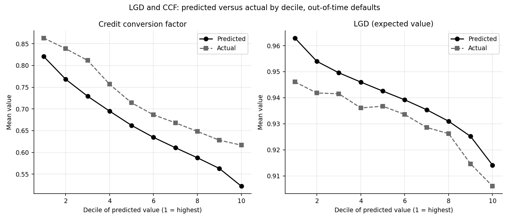{width=90%}

Coefficients with the largest absolute z for the two main regressions are below.

| Term | Coefficient | Std. error | z | p-value |
|:------------------------------|----------:|---------:|----:|-------:|
| const | 1.1294 | 0.0473 | 23.86 | 7.4e-126 |
| total_acc | -0.2582 | 0.0290 | -8.91 | 5.2e-19 |
| mths_since_last_record_reported | -0.7956 | 0.1288 | -6.18 | 6.6e-10 |
| revol_bal | -0.1692 | 0.0304 | -5.56 | 2.7e-08 |
| int_rate | 0.1403 | 0.0289 | 4.86 | 1.2e-06 |
| open_acc | 0.1319 | 0.0292 | 4.51 | 6.3e-06 |
| dti | -0.0785 | 0.0232 | -3.39 | 7.1e-04 |
| credit_age_m | -0.0725 | 0.0216 | -3.36 | 7.8e-04 |

Table: LGD stage 1 (any recovery), largest |z| terms.

| Term | Coefficient | Std. error | t | p-value |
|:------------------------------|----------:|---------:|-----:|------:|
| const | 0.6661 | 0.0046 | 145.96 | 0.0e+00 |
| term_m | 0.0479 | 0.0024 | 20.33 | 1.2e-90 |
| int_rate | 0.0414 | 0.0028 | 14.96 | 3.3e-50 |
| inq_last_6mths | 0.0173 | 0.0020 | 8.65 | 5.9e-18 |
| mths_since_last_delinq_reported | -0.0313 | 0.0045 | -6.94 | 4.0e-12 |
| open_acc | -0.0196 | 0.0028 | -6.90 | 5.5e-12 |
| total_acc | 0.0157 | 0.0029 | 5.41 | 6.4e-08 |
| purpose=small_business | 0.0435 | 0.0082 | 5.33 | 1.0e-07 |

Table: EAD (CCF) regression, largest |t| terms.

## Immature recoveries

Recoveries arrive months or years after charge-off. Loans that defaulted late in the observation window have had little time to recover, so recovery rates and the share with any recovery are understated for them.

| Year of last payment | Charged-off loans | Any recovery | Mean recovery rate | Mean CCF |
|:-------------------|----------------:|-----------:|-----------------:|-------:|
| 2007 | 1 | 100.00% | 0.0428 | 0.951 |
| 2008 | 188 | 50.53% | 0.0680 | 0.846 |
| 2009 | 405 | 56.54% | 0.0594 | 0.752 |
| 2010 | 706 | 61.33% | 0.0597 | 0.726 |
| 2011 | 1,227 | 68.13% | 0.0711 | 0.766 |
| 2012 | 2,698 | 74.24% | 0.0517 | 0.778 |
| 2013 | 6,554 | 74.61% | 0.0682 | 0.769 |
| 2014 | 15,090 | 70.39% | 0.0816 | 0.749 |
| 2015 | 16,348 | 32.19% | 0.0393 | 0.700 |
| 2016 | 19 | 0.00% | 0.0000 | 0.645 |

Table: Charged-off loans by year of last payment (a proxy for default year, because the file has no default date).

The share of defaults with any recovery is 74% for defaults with a last payment in 2012 and 75% in 2013, falls to 70% in 2014 and to 32% in 2015. The 2014 and 2015 figures are immature, not a change in recovery behaviour, so 2014 loans are reported but not fitted and the stage 1 model, which predicts a recovery probability near 74% for every sample, over-predicts for recent cohorts mechanically (finding F-11). A production LGD should be built on mature default cohorts or use a development-pattern adjustment.

## Expected-loss back-test: 12-month

For each loan the 12-month expected loss is $EL = PD_{12}\times LGD\times EAD$, with the champion scorecard's PD. The back-test sums EL and compares it with the realized net loss of loans that actually went bad inside the 12-month window (funded minus principal repaid minus recoveries plus collection fees).

| Vintage | Loans | Mean PD | Bad rate | EL (USD m) | Realized (USD m) | EL / realized | Sample |
|:------|------:|------:|-------:|---------:|---------------:|------------:|-----------------------------------:|
| 2010 | 11,536 | 4.74% | 3.95% | 3.3 | 3.8 | 0.880 | development (in-sample PD, LGD, EAD) |
| 2011 | 21,721 | 4.69% | 4.56% | 8.2 | 10.0 | 0.817 | development (in-sample PD, LGD, EAD) |
| 2012 | 53,367 | 4.76% | 4.99% | 22.2 | 29.9 | 0.744 | development (in-sample PD, LGD, EAD) |
| 2013 | 134,755 | 4.91% | 4.25% | 59.9 | 67.2 | 0.892 | out_of_time |
| 2014 | 225,321 | 4.95% | 4.66% | 99.5 | 121.0 | 0.822 | out_of_time |

Table: 12-month expected versus realized loss by vintage. Vintages to 2012 are development (in-sample PD, LGD and EAD) and 2013 and 2014 are out of time. For 2014 the realized loss is incomplete because loans that are bad but not yet charged off carry no realized loss.

For the 2013 vintage the model expects USD 59.9 million (3.02% of funded) against a realized USD 67.2 million (3.39%), a ratio of 0.892. For 2014 the figures are USD 99.5 million against USD 121.0 million (ratio 0.822); since 2014 realized loss is a lower bound, the true shortfall is larger. In development the ratio is also below one in every vintage, so the shortfall is not purely out-of-time. By grade for 2013:

| Grade | Loans | Mean PD | Bad rate | EL (USD m) | Realized (USD m) | EL / realized |
|:----|-----:|------:|-------:|---------:|---------------:|------------:|
| A | 17,675 | 1.56% | 1.04% | 2.12 | 2.03 | 1.045 |
| B | 44,098 | 3.25% | 2.54% | 10.38 | 11.25 | 0.923 |
| C | 38,113 | 5.42% | 4.39% | 18.28 | 18.54 | 0.986 |
| D | 20,558 | 7.33% | 6.81% | 12.45 | 15.33 | 0.812 |
| E | 9,057 | 8.34% | 8.53% | 8.65 | 10.71 | 0.808 |
| F | 4,390 | 10.92% | 10.87% | 6.44 | 7.39 | 0.872 |
| G | 864 | 10.98% | 11.23% | 1.57 | 1.90 | 0.826 |

Table: 12-month expected versus realized loss by grade, 2013 vintage.

Grades A and C are close (ratios near one), B is slightly under-estimated; D, E, F and G are under-estimated, in line with their PDs and with the fall in LGD predictions for riskier loans. For 2014 the ratios for the riskiest grades are E 0.69, F 0.70, G 0.56.

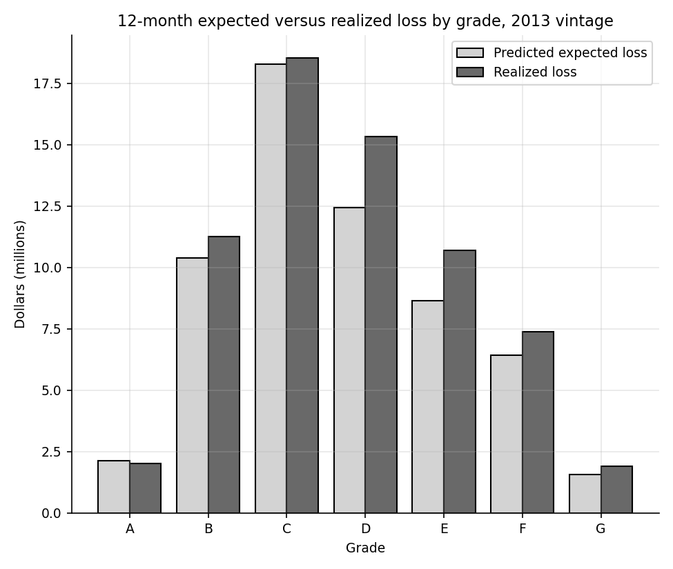{width=70%}

## Expected-loss back-test: lifetime

The original project computed a lifetime expected loss of 7.98% of funded amount (USD 531.9 million) by applying a lifetime PD to every loan, including loans already repaid, charged-off or seasoned (finding F-04). That number cannot be compared with a realized loss. The lifetime back-test here uses only the complete 36-month cohort: a scorecard is refit with the lifetime flag on 36-month loans issued from 2007 to 2011 and tested on 2012 loans against realized lifetime net loss.

| Grade | Loans | Mean lifetime PD | Observed | EL % funded | Realized % funded | EL / realized |
|:----|-----:|---------------:|-------:|----------:|----------------:|------------:|
| A | 10,753 | 5.66% | 7.24% | 2.93% | 3.54% | 0.827 |
| B | 16,805 | 10.26% | 12.63% | 5.55% | 6.38% | 0.869 |
| C | 9,902 | 14.71% | 17.70% | 8.37% | 8.93% | 0.937 |
| D | 5,088 | 17.14% | 21.32% | 10.05% | 11.34% | 0.886 |
| E | 795 | 19.33% | 22.01% | 11.76% | 12.39% | 0.949 |
| F | 103 | 20.99% | 18.45% | 12.62% | 13.31% | 0.948 |
| G | 24 | 17.59% | 16.67% | 11.47% | 9.66% | 1.187 |
| ALL | 43,470 | 11.13% | 13.66% | 6.42% | 7.20% | 0.892 |

Table: Lifetime expected versus realized loss by grade for 2012 36-month loans (`el_backtest_lifetime.csv`).

On 2012 loans the expected loss is 6.42% of funded against a realized 7.20% (ratio 0.892), whereas in the training years the ratio is 1.027, so the in-sample match deteriorates out of time. The predicted lifetime EL is lower than the original project's headline figure, as it should be: the original applied lifetime PD to every loan regardless of status.

# Sensitivity and stress analysis

## Design

Sensitivity analysis asks how the answer moves when assumptions move. All runs use 2013 loans and the champion unless noted. Feature shocks add 5 points to DTI, 2 points to the interest rate, cut income by 10%, add 10 points to revolving utilization and add one inquiry, singly and together. PD multipliers scale every PD by 1.25 and 1.5, and an LGD add-on of 0.10 is applied. Definition variants refit the scorecard under a different target (In Grace Period as bad, a 24-month window, DNMCP loans included) or different binning settings (minimum share 3, 5 and 10%, maximum bins 5, 8 and 12) and report the new Gini on 2013 loans.

| Scenario | Mean PD | Change in PD | Change in EL | Rank correlation | Loans changing PD band | Gini (refit variants) |
|:------------------------|------:|-----------:|-----------:|---------------:|---------------------:|--------------------:|
| shock_dti_pts | 5.11% | +4.2% | +4.5% | 0.9985 | 17.5% | n/a |
| shock_int_rate_pts | 4.91% | +0.0% | +2.3% | 1.0000 | 0.0% | n/a |
| shock_income_pct | 5.18% | +5.7% | +6.7% | 0.9938 | 22.2% | n/a |
| shock_revol_util_pts | 5.08% | +3.6% | +3.3% | 0.9977 | 13.6% | n/a |
| shock_inq_add | 6.02% | +22.7% | +24.5% | 0.9878 | 70.7% | n/a |
| shock_combined | 6.86% | +39.8% | +46.4% | 0.9770 | 82.2% | n/a |
| pd_x1.25 | 6.13% | +25.0% | +25.0% | 1.0000 | 78.5% | n/a |
| pd_x1.5 | 7.36% | +50.0% | +50.0% | 1.0000 | 86.0% | n/a |
| lgd_add_0.1 | 4.91% | +0.0% | +6.8% | 1.0000 | 0.0% | n/a |
| binning_min_share_3% | 4.91% | +0.1% | +0.1% | 0.9995 | 5.1% | 0.3533 |
| binning_min_share_5% | 4.91% | +0.0% | +0.0% | 1.0000 | 0.0% | 0.3530 |
| binning_min_share_10% | 4.90% | -0.1% | -0.5% | 0.9964 | 16.7% | 0.3516 |
| binning_max_bins_5 | 4.90% | -0.0% | +0.3% | 0.9990 | 8.9% | 0.3516 |
| binning_max_bins_8 | 4.91% | +0.0% | +0.0% | 1.0000 | 0.0% | 0.3530 |
| binning_max_bins_12 | 4.91% | +0.0% | +0.0% | 1.0000 | 0.0% | 0.3530 |
| target_in_grace_bad | 4.91% | +0.0% | +0.0% | 1.0000 | 0.0% | 0.3530 |
| target_24m_window | 11.61% | +136.7% | +112.5% | 0.9543 | 89.0% | 0.3278 |
| population_dnmcp_included | 4.93% | +0.6% | +0.6% | 0.9759 | 41.5% | 0.3496 |

Table: Sensitivity of SC_FULL on 2013 loans. Refit variants report Gini; others report rank correlation with the baseline PDs and the share of loans that change PD band.

## Reading the results

- **Inquiries dominate the feature shocks.** One extra inquiry moves mean PD by +22.7% and expected loss by +24.5%, because most applicants have zero or one inquiry and the first bin carries a large positive WoE, so one more inquiry moves a large share of loans into a worse points bin. The combined shock moves PD by +39.8% and EL by +46.4%.
- **The interest-rate shock does nothing to the scorecard PD** (+0.0%) because SC_FULL uses sub_grade rather than the interest rate, but it moves EL by +2.3% through the LGD and EAD models, and it moves XGBoost PD by +15.0%. The sensitivity to a variable depends on which model is asked, which is the point of running several.
- **Target definition matters most.** A 24-month window raises mean PD to 11.61% (+136.7%) and EL by +112.5%, and the refit Gini is 0.3278. Because a lender's PD horizon is a policy choice, the horizon should always be stated next to the number.
- **In Grace Period coding and DNMCP inclusion are immaterial** for the 12-month target (mean PD changes +0.0% and +0.57%).
- **Binning choices are not a source of fragility.** Refit Gini on 2013 loans ranges from 0.3516 to 0.3533 over the six binning settings.

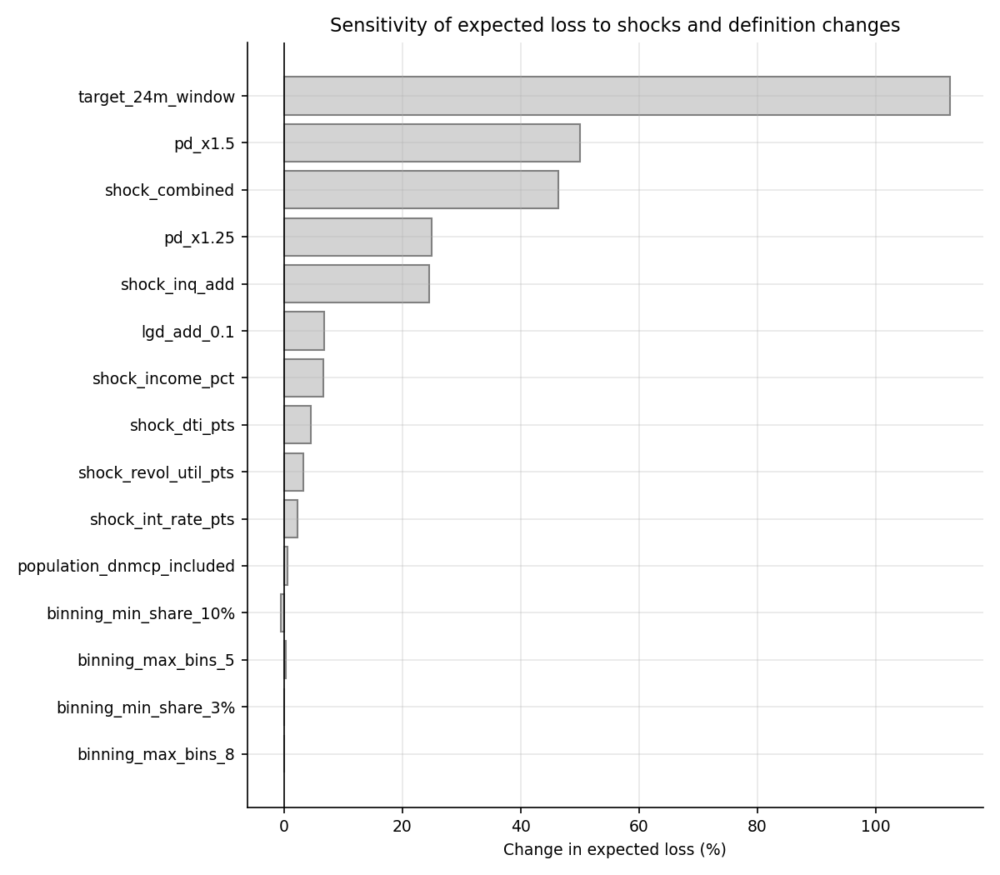{width=80%}

# Explainability: SHAP versus the scorecard

## SHAP in one page

For a tree model there is no coefficient table. **SHAP** values (Lundberg and Lee, 2017) assign to every feature a contribution to each prediction, derived from Shapley values in cooperative game theory: the contribution of feature $j$ to loan $i$ is the average change in the prediction when $j$ is added to every possible subset of the other features,

$$\phi_j = \sum_{S\subseteq F\setminus\{j\}}\frac{|S|!\,(|F|-|S|-1)!}{|F|!}\Big[f_{S\cup\{j\}}(x_S\cup x_j) - f_S(x_S)\Big],$$

and for a given loan the SHAP values add up to the difference between the prediction and the average prediction. For tree ensembles the sum can be computed exactly and quickly (`explain.shap_matrix`, using 5,000 loans from the 2013 sample). Here SHAP explains the model's raw log-odds, not the calibrated probability. Importance is the mean absolute SHAP value per feature.

## Comparison with the scorecard's own ranking

| Variable | Mean |SHAP| | SHAP rank | IV | IV rank | Points range | In scorecard |
|:---------------------|----------:|--------:|-----:|------:|-----------:|-----------:|
| int_rate | 0.2270 | 1 | n/a | n/a | n/a | no |
| sub_grade | 0.1588 | 2 | 0.2440 | 1 | 50.5 | yes |
| annual_inc | 0.1283 | 3 | 0.0553 | 4 | 22.6 | yes |
| inq_last_6mths | 0.1165 | 4 | 0.0880 | 3 | 20.0 | yes |
| purpose | 0.0929 | 5 | 0.0909 | 2 | 37.1 | yes |
| addr_state | 0.0831 | 6 | 0.0297 | 7 | 20.2 | yes |
| dti | 0.0393 | 7 | 0.0239 | 8 | 6.5 | yes |
| mths_since_last_delinq | 0.0299 | 8 | n/a | n/a | n/a | no |
| pti | 0.0258 | 9 | n/a | n/a | n/a | no |
| loan_to_inc | 0.0256 | 10 | 0.0528 | 5 | 7.6 | yes |
| revol_bal | 0.0142 | 11 | n/a | n/a | n/a | no |
| revol_util | 0.0137 | 12 | 0.0451 | 6 | 19.9 | yes |

Table: LightGBM importance (mean absolute SHAP) against the scorecard's IV and points range.

The leading drivers are the same: int_rate is the top feature of the tree model (mean |SHAP| 0.227) and sub_grade is second, while the scorecard places sub_grade, purpose and inquiries at the top by IV. Two differences are worth noting. The tree uses both int_rate and sub_grade (each carries lender information, and the scorecard keeps only sub_grade after the correlation filter), and the grade variable has SHAP importance of 0.0000 because sub_grade already contains it. And mths_since_last_delinq and payment-to-income appear in the tree's top ten but not in the scorecard: the first because the scorecard's IV filter dropped it for low IV (a missing-value pattern the tree can exploit) and the second because it is correlated with loan-to-income. The agreement in the main drivers is reassuring; the disagreement in the secondary ones is where the scorecard might be missing information.

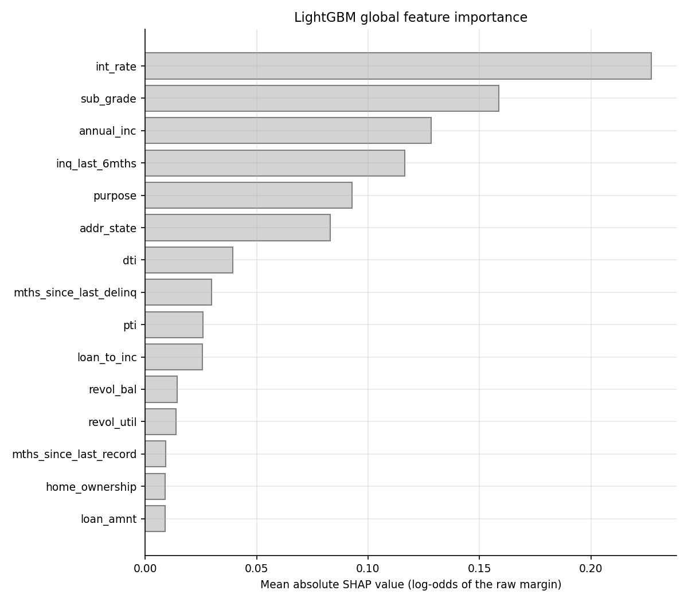{width=80%}

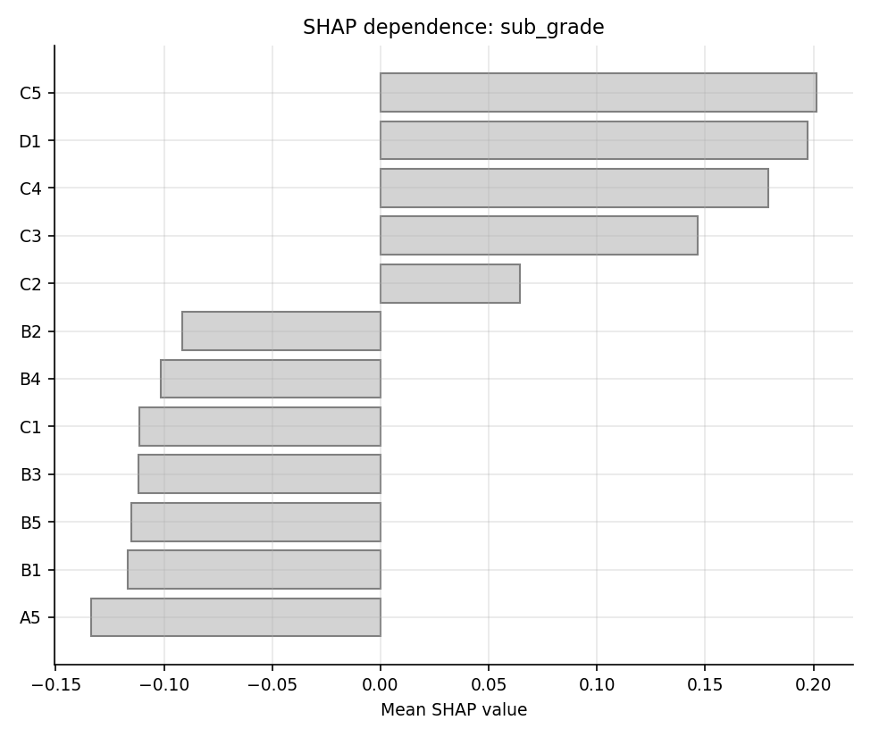{width=60%}

# Findings log

34 findings are logged in `findings_log.csv`: 16 High, 16 Medium and 2 Low. Findings from the as-built review of the original project are marked "review"; findings from the automated test battery (any Red maps to High, any Amber to Medium) are marked "auto". The original developer (the author) reads the review findings as constructive: each has a remediation implemented in this project.

| Severity | Source | Findings |
|:-------|-----:|-------:|
| High | auto | 11 |
| High | review | 5 |
| Low | review | 2 |
| Medium | auto | 9 |
| Medium | review | 7 |

Table: Findings by severity and source.

## High-severity findings in full

**F-01: PD model uses mths_since_issue_d, a vintage and censoring proxy** (area: Model design; source: review; evidence file: `validation_results.csv`).

Description: The original PD model includes loan age measured from issue date to a fixed reference date. It encodes vintage, and recent vintages have shorter observation windows, so the feature partly learns the censoring pattern instead of borrower risk.

Evidence: Original notebook feature list contains mths_since_issue_d; lifetime bad rate by vintage falls from 26% (2007) to 9% (2014) while the fixed 12-month flag is flat at about 4-5% from 2010 to 2014. Computed here: reproduced original model (including mths_since_issue_d) has Gini 0.404 on its random test split.

Recommendation: Remove the feature. Use application-time characteristics only and validate on time-ordered out-of-time samples.

**F-02: Only random 80/20 splits; no out-of-time test** (area: Data and sampling; source: review; evidence file: `validation_results.csv`).

Description: Development and test sets are random draws over 2007-2014, so the test set shares vintages and economic conditions with training. Performance on it cannot show how the model behaves on later cohorts.

Evidence: Original notebook splits all 466,285 loans at random 80/20. This validation uses development 2007-06 to 2012-12, OOT1 2013 and OOT2 2014-01 to 2014-11. Computed here: random-split Gini of the reproduced model 0.404; time-ordered OOT 2013 Gini of the scorecard 0.353 (development holdout 0.372).

Recommendation: Adopt time-ordered development, out-of-time and recent-vintage monitoring samples as the standard test design.

**F-03: Lifetime default flag is right-censored** (area: Target definition; source: review; evidence file: `by_vintage.csv`).

Description: A loan issued in 2014 has had at most about two years to default while a 2007 loan has had the full term, so the lifetime bad rate falls mechanically with vintage and is not comparable across cohorts.

Evidence: Lifetime bad rate by vintage falls from 26% (2007) to 9% (2014); the fixed 12-month window with an observation buffer is flat at about 4-5% from 2010 to 2014. Computed here: fixed 12-month bad rate by vintage 2010-2014 ranges from 3.95% to 4.99%.

Recommendation: Define default on a fixed performance window and keep only loans observed for the full window plus a buffer.

**F-04: Expected loss uses lifetime PD over all loans** (area: Loss estimation; source: review; evidence file: `el_backtest_lifetime.csv`).

Description: Applying a lifetime PD to every loan, including already-resolved and seasoned loans, mixes bases and cannot be compared with realized loss. The headline expected loss is therefore not directly comparable with a realized loss.

Evidence: Original expected loss is 7.98% of funded amount, $531.9M. The back-test on the complete 36-month cohort is in el_backtest_lifetime.csv. Computed here on the complete 36-month cohort (2012 test): predicted EL 6.42% of funded against realized 7.20%.

Recommendation: Compute expected loss on a stated horizon (12-month) for the performing book and back-test against realized loss by grade and vintage.

**F-05: LGD stage 1 applied as hard 0/1 labels** (area: LGD model; source: review; evidence file: `lgd_ead_summary.json`).

Description: The stage 1 recovery model outputs a probability of any recovery, but the original notebook converts it into hard classes (Final notebook cell 132) before combining with the stage 2 recovery rate. This discards the probability information.

Evidence: Original: stage 1 thresholded to 0/1 in cell 132. Overall mean recovery rate is 0.061 and 56% of charged-off loans have any recovery, so a hard 0/1 cut differs from the expected value. Expected-value and hard-class LGD are compared in lgd_ead_summary.json. Computed here on oot_2013 defaults: LGD R-squared 0.009 with the expected-value combination versus -0.012 with hard 0/1 classes.

Recommendation: Combine as LGD = 1 - P(recovery) * E[recovery rate | recovery]; report the hard-class version only as a comparison.

**F-18: hl_p Red for sc_full (2 samples)** (area: Calibration; source: auto; evidence file: `calibration_sc_full_oot1.csv`).

Description: Automated validation test hl_p returned Red.

Evidence: hl_p against threshold Green >= 0.05; Amber >= 0.01 for sc_full; oot1: 2.819e-26 (Red), oot2: 4.252e-16 (Red). Hosmer-Lemeshow has very high power at this sample size, so read it with the calibration slope and table.

Recommendation: Recalibrate the PD (intercept or slope) on recent vintages and monitor calibration quarterly.

**F-19: binomial_grade_min_p Red for sc_full oot2** (area: Calibration; source: auto; evidence file: `grade_binomial_oot2.csv`).

Description: Automated validation test binomial_grade_min_p returned Red.

Evidence: binomial_grade_min_p against threshold Green >= 0.05; Amber >= 0.0001 for sc_full; oot2: 1.515e-15 (Red).

Recommendation: Recalibrate the PD (intercept or slope) on recent vintages and monitor calibration quarterly.

**F-20: gini Red for sc_indep (4 samples)** (area: Discrimination; source: auto; evidence file: `validation_results.csv`).

Description: Automated validation test gini returned Red.

Evidence: gini against threshold Green >= 0.4; Amber >= 0.3 for sc_indep; dev_holdout: 0.3221 (Amber), oot1: 0.2945 (Red), oot2: 0.2658 (Red), complete36: 0.2724 (Red).

Recommendation: Refit or redesign the model on the failing population and re-run the out-of-time discrimination tests.

**F-21: ks Red for sc_indep (4 samples)** (area: Discrimination; source: auto; evidence file: `validation_results.csv`).

Description: Automated validation test ks returned Red.

Evidence: ks against threshold Green >= 0.3; Amber >= 0.2 for sc_indep; dev_holdout: 0.2405 (Amber), oot1: 0.2084 (Amber), oot2: 0.1916 (Red), complete36: 0.1964 (Red).

Recommendation: Refit or redesign the model on the failing population and re-run the out-of-time discrimination tests.

**F-22: hl_p Red for sc_indep (2 samples)** (area: Calibration; source: auto; evidence file: `calibration_sc_indep_oot1.csv`).

Description: Automated validation test hl_p returned Red.

Evidence: hl_p against threshold Green >= 0.05; Amber >= 0.01 for sc_indep; oot1: 4.151e-07 (Red), oot2: 1.102e-23 (Red). Hosmer-Lemeshow has very high power at this sample size, so read it with the calibration slope and table.

Recommendation: Recalibrate the PD (intercept or slope) on recent vintages and monitor calibration quarterly.

**F-24: binomial_grade_min_p Red for sc_indep (3 samples)** (area: Calibration; source: auto; evidence file: `grade_binomial_oot1.csv`).

Description: Automated validation test binomial_grade_min_p returned Red.

Evidence: binomial_grade_min_p against threshold Green >= 0.05; Amber >= 0.0001 for sc_indep; dev_holdout: 0.002724 (Amber), oot1: 9.55e-11 (Red), oot2: 8.074e-62 (Red).

Recommendation: Recalibrate the PD (intercept or slope) on recent vintages and monitor calibration quarterly.

**F-27: hl_p Red for sc_full_recal oot2** (area: Calibration; source: auto; evidence file: `calibration_sc_full_recal_oot2.csv`).

Description: Automated validation test hl_p returned Red.

Evidence: hl_p against threshold Green >= 0.05; Amber >= 0.01 for sc_full_recal; oot2: 4.228e-24 (Red). Hosmer-Lemeshow has very high power at this sample size, so read it with the calibration slope and table.

Recommendation: Recalibrate the PD (intercept or slope) on recent vintages and monitor calibration quarterly.

**F-28: binomial_grade_min_p Red for sc_full_recal oot2** (area: Calibration; source: auto; evidence file: `grade_binomial_oot2.csv`).

Description: Automated validation test binomial_grade_min_p returned Red.

Evidence: binomial_grade_min_p against threshold Green >= 0.05; Amber >= 0.0001 for sc_full_recal; oot2: 5.079e-43 (Red).

Recommendation: Recalibrate the PD (intercept or slope) on recent vintages and monitor calibration quarterly.

**F-30: csi_max Red for all (2 samples)** (area: Stability; source: auto; evidence file: `psi_csi.csv`).

Description: Automated validation test csi_max returned Red.

Evidence: csi_max against threshold Green <= 0.1; Amber <= 0.25 for all; oot1: 0.4752 (Red), oot2: 1.578 (Red).

Recommendation: Investigate the drifting characteristics, document the cause, and set a re-development trigger.

**F-31: benchmark_sc_indep_vs_sub_grade_dauc Red for sc_indep (2 samples)** (area: Discrimination; source: auto; evidence file: `benchmark.csv`).

Description: Automated validation test benchmark_sc_indep_vs_sub_grade_dauc returned Red.

Evidence: benchmark_sc_indep_vs_sub_grade_dauc against threshold Green: beats sub_grade with DeLong p < 0.05; Amber: ahead but not significant; Red: does not beat for sc_indep; oot1: -0.0263 (Red), oot2: -0.0501 (Red).

Recommendation: Refit or redesign the model on the failing population and re-run the out-of-time discrimination tests.

**F-32: benchmark_sc_full_vs_sub_grade_dauc Red for sc_full (2 samples)** (area: Discrimination; source: auto; evidence file: `benchmark.csv`).

Description: Automated validation test benchmark_sc_full_vs_sub_grade_dauc returned Red.

Evidence: benchmark_sc_full_vs_sub_grade_dauc against threshold Green: beats sub_grade with DeLong p < 0.05; Amber: ahead but not significant; Red: does not beat for sc_full; oot1: 0.002928 (Amber), oot2: -0.01023 (Red).

Recommendation: Refit or redesign the model on the failing population and re-run the out-of-time discrimination tests.

## Other findings

| ID | Area | Title | Severity | Light | Source |
|:---|----------------:|---------------------------------------:|-------:|----:|-----:|
| F-06 | Statistics | Wald p-values from the custom logistic class are invalid | Medium | Amber | review |
| F-07 | Model design | Grade and interest rate (LendingClub risk outputs) used as PD features | Medium | Amber | review |
| F-08 | Target definition | Default timing proxied by last payment date | Medium | Amber | review |
| F-09 | Target definition | In Grace Period coded good in the code but described as bad in the project notes | Medium | Amber | review |
| F-10 | Reproducibility | pd_model.sav loaded without fitting code; missing dummies silently zero-filled | Medium | Amber | review |
| F-11 | Data quality | Immature recoveries on recent defaults | Medium | Amber | review |
| F-12 | Data quality | Structural breaks in input features | Medium | Amber | review |
| F-15 | Discrimination | gini Amber for sc_full (4 samples) | Medium | Amber | auto |
| F-16 | Discrimination | ks Amber for sc_full (4 samples) | Medium | Amber | auto |
| F-17 | Calibration | central_tendency Amber for sc_full oot1 | Medium | Amber | auto |
| F-23 | Calibration | cal_slope Amber for sc_indep oot2 | Medium | Amber | auto |
| F-25 | Discrimination | gini Amber for sc_full_recal oot2 | Medium | Amber | auto |
| F-26 | Discrimination | ks Amber for sc_full_recal oot2 | Medium | Amber | auto |
| F-29 | Discrimination | gini_decay Amber for sc_indep oot2 | Medium | Amber | auto |
| F-33 | Loss estimation | Expected loss versus realized loss gap: 12-month EL, first fully resolved out-of-time vintage | Medium | Amber | auto |
| F-34 | Loss estimation | Expected loss versus realized loss gap: lifetime EL, 2012 test cohort | Medium | Amber | auto |
| F-13 | Reporting | EAD summary prints the LGD stage 2 p-values | Low | Amber | review |
| F-14 | Data quality | Two-digit year in earliest_cr_line | Low | Green | review |

Table: Medium and Low findings (titles only). Descriptions, evidence and recommendations are in `findings_log.csv`.

The medium review findings cover invalid Wald p-values, the grade and interest-rate circularity, the last-payment-date default proxy, the In Grace Period coding mismatch, the missing fitting code with silent zero-filling of dummies, immature recoveries and structural breaks in inputs. The Low items are the EAD summary that prints the LGD stage 2 p-values (the EAD coefficients are re-estimated in `ead_coefs.csv`) and the two-digit year parse.

# Limitations

- **One lender, one era, and public data only.** The file contains 2007 to 2014 loans from one platform; the credit environment, underwriting rules and data fields changed during that time. Nothing here supports conclusions about other lenders or later years.
- **No true default date.** Timing is proxied by the last payment date; a loan that kept paying partially after missing payments is dated late. The 12-month window is therefore approximate.
- **Censoring and immature recoveries.** Even the fixed window has the 2014 cohort partly unresolved, and LGD for recent defaults is understated in recovery. The 2014 expected-loss comparison is a lower bound on realized loss.
- **No credit bureau score.** The public file has no FICO score, so the independent model is deprived of the most predictive underwriting input, and the benchmark (the lender's sub-grade) embeds it.
- **Generic thresholds.** The traffic-light cut-offs are conventions, not policy. Amber on Gini would not be a defect for every portfolio.
- **Power of large-sample tests.** Hosmer-Lemeshow and binomial tests reject small gaps; they are reported with the effect size alongside.
- **Same author.** The validator is the model's original developer, so independence is procedural only.
- **No macroeconomic dimension.** There is no stress calibrated to economic scenarios; the sensitivity analysis is mechanical shocks.
- **Reproduction without the original artifact.** The original pickled PD model is not available, so the reproduction re-fits a specification transcribed from the notebooks.

# Excel workbook walkthrough and reconciliation

## Purpose

The Excel workbook (`excel/credit_validation_workbook.xlsx`) re-implements the key validation calculations with live formulas on a stratified sample of 2013 loans (5,000 loans, sampled proportionally by grade with a floor so thin grades appear). A reviewer who does not trust code can change an input and watch every number move. The workbook is plain in format on purpose.

## Sheets

- **README** describes the workbook and the colour-free conventions.
- **Inputs** holds the scaling parameters (PDO, base score, base odds), the PSI floor, the traffic-light thresholds and the attributes for the calculator loan.
- **Scorecard** is the typed points table (bin edges, WoE, coefficients, points) exported from Python.
- **Score_Calc** is a live one-loan calculator: bin lookup, WoE, points, total score, log-odds and PD. The bin rule is the same as in Python (value greater than the lower edge and up to the upper edge, implemented as a count of edges below the value plus one), and categorical lookups use INDEX and MATCH.
- **Loan_Sample** holds the typed attributes and outcomes plus live bin index, WoE, points, score, PD and expected loss for each loan, alongside the Python PD and points.
- **Deciles** builds the decile table with COUNTIFS and SUMIFS, with a rank tie-break (RANK.EQ plus a running COUNTIF), the KS statistic and lift.
- **Calibration** computes decile and grade calibration, the Hosmer-Lemeshow statistic with CHISQ.DIST.RT, the binomial z with NORM.S.DIST and the Jeffreys p-value with BETA.DIST.
- **PSI** holds typed development bins and live out-of-time shares and the PSI.
- **EL** computes expected loss by grade against typed realized loss.
- **Checks** compares each Excel result with its Python value.
- **Conclusions** holds the static written conclusions.
- **Python_Ref** holds the Python reference values for reconciliation.

## Reconciliation

`reconcile_excel.py` recalculates the workbook headlessly, reads the values back, and compares them with independent Python computations at tight tolerances (PD 1e-9, points and score 1e-6, counts exact, KS, PSI and bad rates 1e-9, Hosmer-Lemeshow statistic 1e-6, p-values 1e-8, expected loss to the cent), on two input cases (the base loan and a loan with DTI raised by 5 points).

Overall result: **all comparisons passed**. The reconciliation ran 2 scenario cases. The workbook holds 193,154 formulas. The largest absolute difference across all quantities is 2.3e-09 (`el_total_usd`). The table lists the 10 largest of 58 compared quantities; all others are smaller. Differences of order 1e-13 to 1e-16 are floating-point rounding.

| Quantity | Worst absolute difference |
|:-----------------------|------------------------:|
| el_total_usd | 2.3e-09 |
| total_el_usd | 1.4e-09 |
| el_grade_usd | 5.8e-10 |
| el_grade_realized_usd | 1.5e-11 |
| loan_el_usd | 7.7e-12 |
| loan_score | 6.8e-13 |
| vs_exported_python_score | 6.8e-13 |
| calc_score | 3.4e-13 |
| calc_points_sum | 3.4e-13 |
| hl_statistic | 6.0e-14 |

Table: Excel reconciliation, from `outputs/excel_reconciliation.json`.

Reconciliation shows that the formulas implement the same mathematics as the code, which lets a reviewer trace any number to a cell. It says nothing about whether the model is right for real loans.

# How to run

The raw data are not included. Place `loan_data_2007_2014.csv` and `loan_data_defaults.csv` in a folder and point `CV_RAW_DIR` at it.

```
cd python
py -3 -m pip install -r requirements.txt
set CV_RAW_DIR=C:\path\to\folder\with\loan_data_2007_2014.csv
py -3 -m credit_validation.cli            # full run (about 9 minutes)
py -3 -m credit_validation.cli --quick    # small run (about 2 minutes)
py -3 -m pytest -q
cd ..
py -3 docs/build_docs.py                  # rebuild this document and the README
```

The command-line run loads the data, builds the targets and samples, reproduces the original model, trains the scorecards and challengers, runs the validation battery, fits LGD and EAD and the expected-loss back-tests, runs the sensitivity analysis and SHAP, writes the findings log and charts, and builds and reconciles the Excel workbook (skip with `--skip-excel`). Every result file lands in `python/outputs/`. `docs/build_docs.py` reads those files and the cached loan parquet, templates every result into the text and rebuilds the Word document, so the document always matches the last run.

# Glossary

- **AUC**: probability that a random bad loan is ranked riskier than a random good loan.
- **Brier score**: mean squared difference between predicted probability and outcome.
- **CAP**: cumulative accuracy profile, share of bads captured against share of loans, riskiest first.
- **CCF**: credit conversion factor, the share of the funded amount still outstanding at default.
- **Censoring**: loans not observed long enough for the outcome to have occurred.
- **CSI**: characteristic stability index, PSI applied to one input variable.
- **DNMCP**: "does not meet the credit policy", a LendingClub status for loans under an earlier policy.
- **EAD**: exposure at default. **EL**: expected loss, PD times LGD times EAD.
- **Gini**: 2 AUC minus 1. **KS**: maximum separation between the cumulative bad and good distributions.
- **Hosmer-Lemeshow**: chi-squared test of predicted against observed bads in score groups.
- **IV**: information value, total separation of a binned variable.
- **LGD**: loss given default. **MRM**: model risk management.
- **OOT**: out of time, a sample from a period after development.
- **PD**: probability of default. **PDO**: points to double the odds.
- **PSI**: population stability index.
- **SHAP**: Shapley-value-based feature contributions.
- **SR 11-7**: the Federal Reserve and OCC supervisory guidance on model risk management.
- **WoE**: weight of evidence, the log ratio of the shares of goods and bads in a bin.

# References

Board of Governors of the Federal Reserve System and Office of the Comptroller of the Currency (2011). Supervisory Guidance on Model Risk Management, SR Letter 11-7, April 2011.

Basel Committee on Banking Supervision (1996). Supervisory Framework for the Use of "Backtesting" in Conjunction with the Internal Models Approach to Market Risk Capital Requirements. Bank for International Settlements.

Siddiqi, N. (2006). Credit Risk Scorecards: Developing and Implementing Intelligent Credit Scoring. Wiley.

DeLong, E. R., DeLong, D. M. and Clarke-Pearson, D. L. (1988). Comparing the areas under two or more correlated receiver operating characteristic curves: a nonparametric approach. Biometrics, 44(3), 837-845.

Hosmer, D. W. and Lemeshow, S. (1980). Goodness of fit tests for the multiple logistic regression model. Communications in Statistics, Theory and Methods, A10(10), 1043-1069.

Chen, T. and Guestrin, C. (2016). XGBoost: a scalable tree boosting system. Proceedings of the 22nd ACM SIGKDD International Conference on Knowledge Discovery and Data Mining.

Lundberg, S. M. and Lee, S.-I. (2017). A unified approach to interpreting model predictions. Advances in Neural Information Processing Systems 30.

LendingClub. Public loan data, loans issued 2007 to 2014. Data source for all results in this document.
